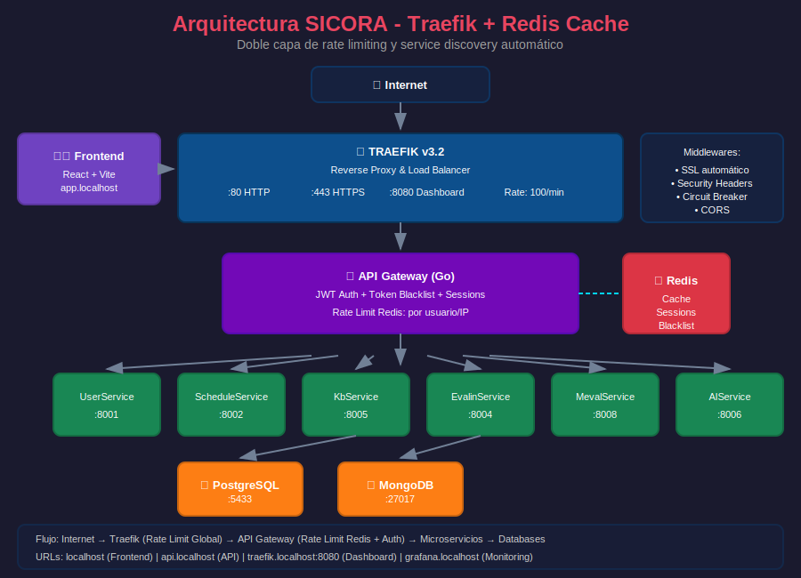

# ADR: Migración de Nginx a Traefik como Reverse Proxy

## Estado

**Aceptado** - Enero 2026

## Diagrama de Arquitectura



## Contexto

SICORA utiliza una arquitectura de microservicios con múltiples backends (Go y Python) que necesitan:

- Reverse proxy para enrutar tráfico
- Balanceo de carga
- SSL/TLS automático
- Rate limiting a nivel de proxy
- Service discovery
- Monitoreo y métricas

Anteriormente se usaba **Nginx** como reverse proxy con configuración estática.

## Decisión

Migrar de **Nginx** a **Traefik v3.2** como reverse proxy principal.

## Comparativa

| Característica        | Nginx                      | Traefik                  |
| --------------------- | -------------------------- | ------------------------ |
| **Configuración**     | Archivos estáticos         | Labels en containers     |
| **SSL/TLS**           | Certbot manual             | Let's Encrypt automático |
| **Service Discovery** | Manual (editar nginx.conf) | Automático via Docker    |
| **Hot Reload**        | Requiere `nginx -s reload` | Automático               |
| **Dashboard**         | No incluido                | Dashboard web incluido   |
| **Métricas**          | Requiere módulo externo    | Prometheus nativo        |
| **Rate Limiting**     | Módulo básico              | Middleware avanzado      |
| **Circuit Breaker**   | No nativo                  | Nativo                   |
| **Curva aprendizaje** | Conocido                   | Moderada                 |

## Razones de la Decisión

### 1. Service Discovery Automático

```yaml
# Nginx: Requiere editar archivo manualmente
upstream userservice {
    server userservice:8000;
}

# Traefik: Labels en docker-compose
labels:
  - "traefik.enable=true"
  - "traefik.http.routers.userservice.rule=Host(`users.localhost`)"
```

### 2. SSL Automático con Let's Encrypt

Traefik gestiona certificados automáticamente sin intervención manual ni cron jobs.

### 3. Integración con Docker

Traefik detecta nuevos contenedores y actualiza rutas sin reinicio.

### 4. Complementa Redis Cache del API Gateway

```
┌─────────────────────────────────────────────────────────────┐
│                         REQUEST                              │
└─────────────────────────────────────────────────────────────┘
                              │
                              ▼
                    ┌──────────────────┐
                    │     TRAEFIK      │
                    │  Rate Limit:     │
                    │  100 req/min     │  ← Capa 1: Global
                    │  (por IP)        │
                    └────────┬─────────┘
                             │
                             ▼
                    ┌──────────────────┐
                    │   API GATEWAY    │
                    │  Rate Limit:     │
                    │  Redis-based     │  ← Capa 2: Por usuario
                    │  (por user/IP)   │
                    └────────┬─────────┘
                             │
                             ▼
                    ┌──────────────────┐
                    │   MICROSERVICES  │
                    └──────────────────┘
```

### 5. Métricas Prometheus Nativas

Traefik expone métricas en formato Prometheus sin configuración adicional:

- `traefik_entrypoint_requests_total`
- `traefik_service_request_duration_seconds`
- `traefik_router_requests_total`

## Configuración Implementada

### Estructura de archivos

```
sicora-infra/
├── docker-compose.traefik.yml    # Compose principal
└── traefik/
    ├── traefik.yml               # Config estática
    ├── .env.example              # Variables
    ├── README.md                 # Documentación
    └── dynamic/
        └── middlewares.yml       # Middlewares
```

### Middlewares configurados

| Middleware          | Descripción             | Aplicación      |
| ------------------- | ----------------------- | --------------- |
| `rate-limit`        | 100 req/min, burst 50   | API general     |
| `rate-limit-strict` | 10 req/min, burst 5     | Login, registro |
| `secure-headers`    | XSS, Clickjacking, HSTS | Todos           |
| `cors-dev`          | CORS para desarrollo    | Dev             |
| `cors-prod`         | CORS para producción    | Prod            |
| `compress`          | Compresión GZIP         | Todos           |
| `circuit-breaker`   | Protección cascada      | Backend         |
| `retry`             | 3 reintentos            | Backend         |

### URLs de desarrollo

| Servicio    | URL                           |
| ----------- | ----------------------------- |
| Frontend    | http://localhost              |
| API Gateway | http://api.localhost          |
| Dashboard   | http://traefik.localhost:8080 |
| Prometheus  | http://prometheus.localhost   |
| Grafana     | http://grafana.localhost      |

## Consecuencias

### Positivas

- **Operaciones simplificadas**: No más edición manual de configs
- **Escalabilidad**: Nuevos servicios se registran automáticamente
- **SSL sin esfuerzo**: Certificados gestionados automáticamente
- **Observabilidad**: Dashboard y métricas incluidos
- **Seguridad mejorada**: Doble rate limiting (Traefik + Redis)
- **Alta disponibilidad**: Circuit breaker y retry automáticos

### Negativas

- **Curva de aprendizaje**: Equipo debe aprender labels de Traefik
- **Dependencia de Docker**: Menos flexible sin containerización
- **Debugging**: Logs diferentes a Nginx

### Mitigación

- Documentación completa en `sicora-infra/traefik/README.md`
- Dashboard visual para debugging
- Nginx se mantiene como referencia en `deployment/nginx-sicora.conf`

## Uso

```bash
# Desarrollo
cd sicora-infra
cp traefik/.env.example .env
docker compose -f docker-compose.traefik.yml up -d

# Ver dashboard
open http://traefik.localhost:8080

# Logs
docker compose -f docker-compose.traefik.yml logs -f traefik
```

## Referencias

- [Documentación Traefik](https://doc.traefik.io/traefik/)
- [Traefik + Docker](https://doc.traefik.io/traefik/providers/docker/)
- [Let's Encrypt con Traefik](https://doc.traefik.io/traefik/https/acme/)
- [sicora-infra/traefik/README.md](../../sicora-infra/traefik/README.md)

---

**Fecha decisión**: Enero 2026  
**Autor**: Equipo SICORA  
**Revisión**: Fase 8 - Implementación Cache Redis
