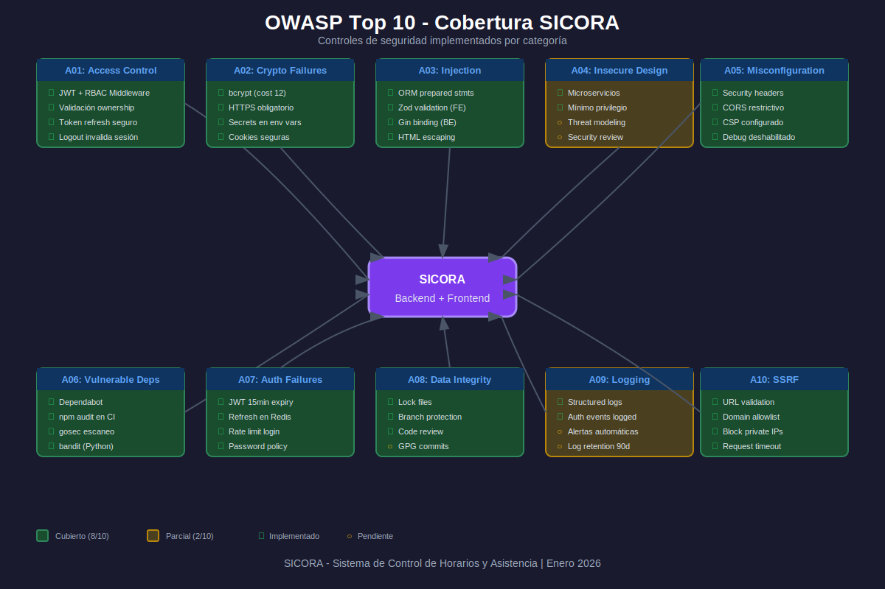

# 🛡️ Cobertura OWASP Top 10 - SICORA

Este documento define la cobertura de seguridad del proyecto SICORA según el estándar **OWASP Top 10 (2025)**.



---

## 📋 Resumen de Cobertura

| #   | Vulnerabilidad            | Estado      | Controles Implementados                |
| --- | ------------------------- | ----------- | -------------------------------------- |
| A01 | Broken Access Control     | 🟢 Cubierto | RBAC, middleware auth, JWT             |
| A02 | Cryptographic Failures    | 🟢 Cubierto | bcrypt, HTTPS, secrets en env          |
| A03 | Injection                 | 🟢 Cubierto | ORM, prepared statements, validación   |
| A04 | Insecure Design           | 🟡 Parcial  | Threat modeling pendiente              |
| A05 | Security Misconfiguration | 🟢 Cubierto | Headers seguridad, CORS, CSP           |
| A06 | Vulnerable Components     | 🟢 Cubierto | npm audit, gosec, dependabot           |
| A07 | Auth Failures             | 🟢 Cubierto | JWT, refresh tokens, rate limiting     |
| A08 | Data Integrity Failures   | 🟢 Cubierto | CI/CD seguro, firma de commits         |
| A09 | Security Logging          | 🟡 Parcial  | Logs estructurados, alertas pendientes |
| A10 | SSRF                      | 🟢 Cubierto | Validación URLs, allowlist             |

---

## 🔐 A01: Broken Access Control

**Riesgo:** Usuarios acceden a recursos sin autorización.

### Controles Implementados

#### Backend Go (`sicora-be-go`)

```go
// Middleware de autenticación JWT
func AuthMiddleware() gin.HandlerFunc {
    return func(c *gin.Context) {
        token := c.GetHeader("Authorization")
        claims, err := ValidateJWT(token)
        if err != nil {
            c.AbortWithStatusJSON(401, gin.H{"error": "unauthorized"})
            return
        }
        c.Set("user_id", claims.UserID)
        c.Set("role", claims.Role)
        c.Next()
    }
}

// Middleware RBAC por rol
func RequireRole(roles ...string) gin.HandlerFunc {
    return func(c *gin.Context) {
        userRole := c.GetString("role")
        for _, role := range roles {
            if userRole == role {
                c.Next()
                return
            }
        }
        c.AbortWithStatusJSON(403, gin.H{"error": "forbidden"})
    }
}
```

#### Frontend (`sicora-app-fe`)

```typescript
// Rutas protegidas con verificación de rol
const ProtectedRoute = ({ roles, children }: Props) => {
  const { user, isAuthenticated } = useAuthStore();

  if (!isAuthenticated) return <Navigate to="/login" />;
  if (roles && !roles.includes(user.role)) return <Navigate to="/403" />;

  return children;
};
```

### ✅ Checklist

- [x] Middleware de autenticación en todas las rutas protegidas
- [x] Verificación de rol (RBAC) por endpoint
- [x] Validación de ownership (usuario solo accede a sus recursos)
- [x] Tokens JWT con expiración corta (15 min access, 7d refresh)
- [x] Logout invalida refresh token en Redis

---

## 🔒 A02: Cryptographic Failures

**Riesgo:** Exposición de datos sensibles por cifrado débil o ausente.

### Controles Implementados

```go
// Hashing de contraseñas con bcrypt (costo 12)
func HashPassword(password string) (string, error) {
    bytes, err := bcrypt.GenerateFromPassword([]byte(password), 12)
    return string(bytes), err
}

// Nunca almacenar contraseñas en texto plano
// Nunca loguear datos sensibles
func (u *User) MarshalJSON() ([]byte, error) {
    type Alias User
    return json.Marshal(&struct {
        *Alias
        Password string `json:"-"` // Excluir de JSON
    }{Alias: (*Alias)(u)})
}
```

### ✅ Checklist

- [x] Contraseñas hasheadas con bcrypt (cost ≥ 12)
- [x] HTTPS obligatorio en producción (Traefik TLS)
- [x] Secrets en variables de entorno (no en código)
- [x] Datos sensibles excluidos de logs
- [x] Cookies con flags `Secure`, `HttpOnly`, `SameSite`

---

## 💉 A03: Injection

**Riesgo:** SQL, NoSQL, OS, LDAP injection por input no sanitizado.

### Controles Implementados

#### GORM (Go) - Prepared Statements

```go
// ✅ CORRECTO: Parámetros enlazados
db.Where("email = ?", email).First(&user)

// ❌ INCORRECTO: Concatenación vulnerable
db.Where("email = '" + email + "'").First(&user)
```

#### Validación de Input (Zod en Frontend)

```typescript
const loginSchema = z.object({
  email: z.string().email('Email inválido'),
  password: z
    .string()
    .min(8, 'Mínimo 8 caracteres')
    .regex(/[A-Z]/, 'Requiere mayúscula')
    .regex(/[0-9]/, 'Requiere número'),
});
```

#### Validación en Go

```go
type LoginRequest struct {
    Email    string `json:"email" binding:"required,email"`
    Password string `json:"password" binding:"required,min=8"`
}
```

### ✅ Checklist

- [x] ORM con prepared statements (GORM, SQLAlchemy)
- [x] Validación de input en frontend (Zod)
- [x] Validación de input en backend (gin binding)
- [x] Escape de HTML en respuestas
- [x] Content-Type validado en uploads

---

## 🏗️ A04: Insecure Design

**Riesgo:** Fallas de diseño que no se pueden corregir con implementación.

### Controles Implementados

- Arquitectura de microservicios con separación de responsabilidades
- Principio de mínimo privilegio en roles
- Rate limiting para prevenir abuso
- Flujos de autenticación siguiendo mejores prácticas

### ⏳ Pendiente

- [ ] Threat modeling formal por módulo
- [ ] Revisión de seguridad por pares
- [ ] Documentación de casos de abuso

### ✅ Checklist

- [x] Separación frontend/backend
- [x] API RESTful con principios SOLID
- [x] Rate limiting configurado
- [ ] Threat modeling documentado

---

## ⚙️ A05: Security Misconfiguration

**Riesgo:** Configuraciones inseguras por defecto o incompletas.

### Controles Implementados

#### Headers de Seguridad (Traefik)

```yaml
# traefik/config/middlewares.yml
http:
  middlewares:
    security-headers:
      headers:
        customResponseHeaders:
          X-Content-Type-Options: 'nosniff'
          X-Frame-Options: 'DENY'
          X-XSS-Protection: '1; mode=block'
          Referrer-Policy: 'strict-origin-when-cross-origin'
          Permissions-Policy: 'geolocation=(), microphone=()'
        contentSecurityPolicy: "default-src 'self'; script-src 'self' 'unsafe-inline'; style-src 'self' 'unsafe-inline'"
        stsSeconds: 31536000
        stsIncludeSubdomains: true
        stsPreload: true
```

#### CORS Configurado (Go)

```go
func CORSMiddleware() gin.HandlerFunc {
    return cors.New(cors.Config{
        AllowOrigins:     []string{"https://sicora.onevision.com"},
        AllowMethods:     []string{"GET", "POST", "PUT", "DELETE"},
        AllowHeaders:     []string{"Authorization", "Content-Type"},
        AllowCredentials: true,
        MaxAge:           12 * time.Hour,
    })
}
```

### ✅ Checklist

- [x] Headers de seguridad configurados
- [x] CORS restrictivo (solo orígenes permitidos)
- [x] Debug mode deshabilitado en producción
- [x] Errores genéricos (sin stack traces)
- [x] Puertos no esenciales cerrados

---

## 📦 A06: Vulnerable and Outdated Components

**Riesgo:** Dependencias con vulnerabilidades conocidas.

### Controles Implementados

#### GitHub Actions - Escaneo Automático

```yaml
# .github/workflows/owasp-top10-scan.yml
- name: Go Security Scan
  run: |
    go install github.com/securego/gosec/v2/cmd/gosec@latest
    gosec -fmt=json -out=gosec-results.json ./...

- name: Python Security Scan
  run: |
    pip install bandit
    bandit -r sicora-be-python -f json -o bandit-results.json

- name: Node.js Audit
  run: |
    cd sicora-app-fe && npm audit --audit-level=high
```

#### Dependabot Configurado

```yaml
# .github/dependabot.yml
version: 2
updates:
  - package-ecosystem: 'gomod'
    directory: '/sicora-be-go'
    schedule:
      interval: 'weekly'
  - package-ecosystem: 'npm'
    directory: '/sicora-app-fe'
    schedule:
      interval: 'weekly'
```

### ✅ Checklist

- [x] Dependabot habilitado
- [x] `npm audit` en CI
- [x] `gosec` para código Go
- [x] `bandit` para código Python
- [x] Revisión semanal de dependencias

---

## 🔑 A07: Identification and Authentication Failures

**Riesgo:** Autenticación débil, sesiones inseguras.

### Controles Implementados

#### JWT con Refresh Tokens

```go
type TokenPair struct {
    AccessToken  string `json:"access_token"`  // 15 min
    RefreshToken string `json:"refresh_token"` // 7 días, almacenado en Redis
}

func GenerateTokenPair(userID string, role string) (*TokenPair, error) {
    accessToken := jwt.NewWithClaims(jwt.SigningMethodHS256, jwt.MapClaims{
        "user_id": userID,
        "role":    role,
        "exp":     time.Now().Add(15 * time.Minute).Unix(),
    })

    refreshToken := uuid.New().String()
    // Almacenar en Redis con TTL de 7 días
    redis.Set(ctx, "refresh:"+refreshToken, userID, 7*24*time.Hour)

    return &TokenPair{...}, nil
}
```

#### Rate Limiting

```go
// 5 intentos de login por minuto por IP
limiter := ratelimit.New(ratelimit.Config{
    Key:      "login:" + c.ClientIP(),
    Limit:    5,
    Duration: time.Minute,
})
```

### ✅ Checklist

- [x] JWT con expiración corta (15 min)
- [x] Refresh tokens en Redis (revocables)
- [x] Rate limiting en login (5/min)
- [x] Bloqueo temporal tras intentos fallidos
- [x] Contraseñas con requisitos de complejidad

---

## 🔄 A08: Software and Data Integrity Failures

**Riesgo:** Código o datos modificados sin verificación.

### Controles Implementados

```yaml
# CI/CD seguro con GitHub Actions
- Commits firmados requeridos
- Branch protection en main
- Code review obligatorio
- Tests automáticos antes de merge
```

#### Package Lock Files

```bash
# Asegurar dependencias exactas
pnpm-lock.yaml  # Frontend
go.sum          # Backend Go
```

### ✅ Checklist

- [x] Lock files versionados
- [x] CI/CD en GitHub Actions (no terceros)
- [x] Branch protection habilitado
- [x] Code review requerido para merge
- [ ] Firma de commits GPG (pendiente)

---

## 📊 A09: Security Logging and Monitoring Failures

**Riesgo:** Ataques no detectados por falta de logging.

### Controles Implementados

#### Logging Estructurado (Go)

```go
logger := zerolog.New(os.Stdout).With().
    Timestamp().
    Str("service", "sicora-api").
    Logger()

// Log de eventos de seguridad
logger.Warn().
    Str("event", "login_failed").
    Str("ip", clientIP).
    Str("email", email).
    Msg("Failed login attempt")
```

#### Eventos a Loguear

| Evento              | Nivel | Campos                |
| ------------------- | ----- | --------------------- |
| Login exitoso       | INFO  | user_id, ip           |
| Login fallido       | WARN  | ip, email, reason     |
| Acceso denegado     | WARN  | user_id, resource, ip |
| Token inválido      | WARN  | ip, token_hash        |
| Rate limit excedido | WARN  | ip, endpoint          |

### ✅ Checklist

- [x] Logging estructurado (JSON)
- [x] Eventos de autenticación logueados
- [x] IP y timestamps en todos los logs
- [ ] Alertas automáticas (Prometheus/Grafana pendiente)
- [ ] Retención de logs (90 días pendiente)

---

## 🌐 A10: Server-Side Request Forgery (SSRF)

**Riesgo:** Servidor hace requests a URLs maliciosas proporcionadas por usuario.

### Controles Implementados

```go
// Validar URLs antes de hacer requests
func ValidateURL(rawURL string) error {
    parsed, err := url.Parse(rawURL)
    if err != nil {
        return err
    }

    // Solo HTTPS
    if parsed.Scheme != "https" {
        return errors.New("only HTTPS allowed")
    }

    // Allowlist de dominios
    allowedDomains := []string{"api.onevision.com", "storage.onevision.com"}
    if !slices.Contains(allowedDomains, parsed.Host) {
        return errors.New("domain not allowed")
    }

    // Bloquear IPs privadas
    ip := net.ParseIP(parsed.Hostname())
    if ip != nil && (ip.IsPrivate() || ip.IsLoopback()) {
        return errors.New("private IPs not allowed")
    }

    return nil
}
```

### ✅ Checklist

- [x] Validación de URLs de usuario
- [x] Allowlist de dominios externos
- [x] Bloqueo de IPs privadas/loopback
- [x] Solo HTTPS para requests externos
- [x] Timeout en requests externos (10s)

---

## 🚀 Implementación CI/CD

El workflow `.github/workflows/owasp-top10-scan.yml` ejecuta análisis de seguridad en cada PR:

```yaml
name: OWASP Security Scan

on:
  push:
    branches: [main, develop]
  pull_request:
    branches: [main]

jobs:
  security-scan:
    runs-on: ubuntu-latest
    steps:
      - uses: actions/checkout@v4

      - name: Go Security (gosec)
        run: gosec -severity high ./sicora-be-go/...

      - name: Python Security (bandit)
        run: bandit -r sicora-be-python -ll

      - name: Node.js Audit
        run: cd sicora-app-fe && npm audit --audit-level=high
```

---

## 📚 Referencias

- [OWASP Top 10 2025](https://owasp.org/Top10/)
- [OWASP Cheat Sheet Series](https://cheatsheetseries.owasp.org/)
- [Go Security Best Practices](https://github.com/securego/gosec)
- [Bandit - Python Security Linter](https://bandit.readthedocs.io/)

---

**Última actualización:** Enero 2026  
**Responsable:** Equipo de Seguridad SICORA
