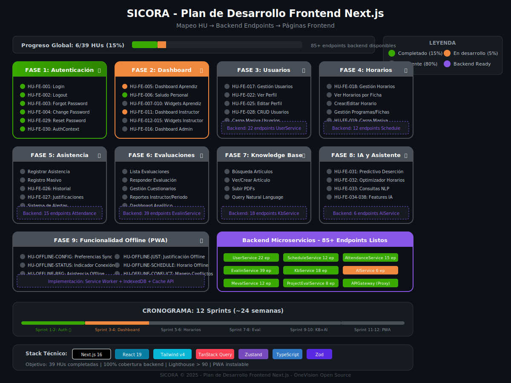

# 📋 PLAN DE DESARROLLO FRONTEND - SICORA NEXT.JS

**Fecha:** 28 de junio de 2025  
**Versión:** 1.1  
**Framework:** Next.js 16 + React 19 + Tailwind v4  
**Estado:** 🚧 EN DESARROLLO

---

## ⚠️ NOTA ARQUITECTÓNICA IMPORTANTE

> **Backend para Producción:** Todos los microservicios están implementados en **Go (Gin Framework)**, excepto **AIService** que es el único servicio en **Python FastAPI**.
>
> El backend en Python/FastAPI (userservice, scheduleservice, attendanceservice, etc.) es un **ejercicio académico** y NO se desplegará en producción.

---

## 🎯 RESUMEN EJECUTIVO

### Estado Actual del Frontend

| Métrica               | Valor          | Objetivo     |
| --------------------- | -------------- | ------------ |
| **HUs Completadas**   | 6/39 (15%)     | 39/39        |
| **HUs En Desarrollo** | 2 (5%)         | -            |
| **HUs Pendientes**    | 31 (80%)       | 0            |
| **Endpoints Backend** | 140+ expuestos | 100% mapeo   |
| **Servicios Backend** | 9 activos      | 9 integrados |

### Backend Disponible para Integración (PRODUCCIÓN)

| Servicio               | Stack    | Endpoints | Estado Backend | % Completado |
| ---------------------- | -------- | --------- | -------------- | ------------ |
| **APIGateway**         | Go (Gin) | Proxy     | ✅ COMPLETO    | 100%         |
| **UserService**        | Go (Gin) | 15        | ✅ COMPLETO    | 95%          |
| **ScheduleService**    | Go (Gin) | 13        | ✅ COMPLETO    | 90%          |
| **AttendanceService**  | Go (Gin) | 28        | ✅ COMPLETO    | 95%          |
| **EvalinService**      | Go (Gin) | 25+       | ✅ COMPLETO    | 90%          |
| **KbService**          | Go (Gin) | 32        | ✅ COMPLETO    | 85%          |
| **MevalService**       | Go (Gin) | 22        | ✅ COMPLETO    | 90%          |
| **ProjectEvalService** | Go (Gin) | 14        | ✅ COMPLETO    | 85%          |
| **AIService**          | Python   | 6         | 🚧 PARCIAL     | 60%          |

---

## 🔗 INVENTARIO DE ENDPOINTS BACKEND (GO - PRODUCCIÓN)

### 1. API Gateway (Go/Gin) - Punto de Entrada

```
# Health Checks
GET  /health              → Health check
GET  /ready               → Readiness check
GET  /live                → Liveness check
GET  /services            → Lista de servicios
GET  /swagger/*           → Documentación Swagger

# Rutas Públicas (sin auth)
POST /api/v1/auth/login        → userservice
POST /api/v1/auth/register     → userservice
POST /api/v1/auth/refresh      → userservice
POST /api/v1/auth/forgot-password → userservice
POST /api/v1/auth/reset-password  → userservice

# Rutas Protegidas (requieren JWT) - Proxy a servicios
POST /api/v1/auth/logout
GET/POST/PUT/DELETE /api/v1/users/*        → userservice
GET/POST/PUT/DELETE /api/v1/schedules/*    → scheduleservice
GET/POST/PUT/DELETE /api/v1/attendance/*   → attendanceservice
GET/POST/PUT/DELETE /api/v1/evaluations/*  → evalinservice
GET/POST/PUT/DELETE /api/v1/knowledge/*    → kbservice
GET/POST/PUT/DELETE /api/v1/projects/*     → projectevalservice
GET/POST/PUT/DELETE /api/v1/meval/*        → mevalservice
POST /api/v1/ai/*                          → aiservice (Python)
```

### 2. UserService (Go/Gin)

```
# Health & Docs
GET  /health                        → HealthCheck
GET  /swagger/*                     → Swagger docs
GET  /admin/security/metrics        → Security metrics

# Autenticación
POST /api/v1/auth/login             → Autenticación
POST /api/v1/auth/logout            → Cerrar sesión
POST /api/v1/auth/refresh           → Refresh token
POST /api/v1/auth/register          → Registro
PUT  /api/v1/auth/change-password   → Cambiar contraseña
PUT  /api/v1/auth/profile           → Actualizar perfil
POST /api/v1/auth/forgot-password   → Recuperar contraseña
POST /api/v1/auth/reset-password    → Restablecer contraseña
POST /api/v1/auth/force-change-password → Forzar cambio

# User CRUD
POST   /api/v1/users                → Crear usuario
GET    /api/v1/users                → Listar usuarios
GET    /api/v1/users/:id            → Obtener usuario
PUT    /api/v1/users/:id            → Actualizar usuario
DELETE /api/v1/users/:id            → Eliminar usuario
PATCH  /api/v1/users/:id/activate   → Activar usuario
PATCH  /api/v1/users/:id/deactivate → Desactivar usuario
```

### 3. ScheduleService (Go/Gin)

```
# Health
GET  /health                        → Health check

# Schedule CRUD
POST   /api/v1/schedules            → Crear horario
GET    /api/v1/schedules            → Listar horarios
GET    /api/v1/schedules/:id        → Obtener horario
PUT    /api/v1/schedules/:id        → Actualizar horario
DELETE /api/v1/schedules/:id        → Eliminar horario

# Master Data - Programas Académicos
POST   /api/v1/master-data/academic-programs → Crear programa
GET    /api/v1/master-data/academic-programs → Listar programas

# Master Data - Grupos/Fichas
POST   /api/v1/master-data/academic-groups   → Crear ficha
GET    /api/v1/master-data/academic-groups   → Listar fichas

# Master Data - Ambientes
POST   /api/v1/master-data/venues            → Crear ambiente
GET    /api/v1/master-data/venues            → Listar ambientes

# Master Data - Sedes
POST   /api/v1/master-data/campuses          → Crear sede
GET    /api/v1/master-data/campuses          → Listar sedes
```

### 4. AttendanceService (Go/Gin)

```
# Health
GET  /health                        → Health check
GET  /ready                         → Readiness check

# Asistencia CRUD
POST   /api/v1/attendance           → Registrar asistencia
GET    /api/v1/attendance/:id       → Obtener registro
PUT    /api/v1/attendance/:id       → Actualizar registro
DELETE /api/v1/attendance/:id       → Eliminar registro
GET    /api/v1/attendance/history   → Historial de asistencia
GET    /api/v1/attendance/summary   → Resumen de asistencia
POST   /api/v1/attendance/qr        → Registrar por QR
POST   /api/v1/attendance/bulk      → Registro masivo

# Justificaciones
POST   /api/v1/justifications           → Crear justificación
GET    /api/v1/justifications/:id       → Obtener justificación
PUT    /api/v1/justifications/:id       → Actualizar justificación
DELETE /api/v1/justifications/:id       → Eliminar justificación
GET    /api/v1/justifications/user      → Justificaciones por usuario
GET    /api/v1/justifications/pending   → Justificaciones pendientes
POST   /api/v1/justifications/:id/approve → Aprobar justificación
POST   /api/v1/justifications/:id/reject  → Rechazar justificación

# Alertas
POST   /api/v1/alerts               → Crear alerta
GET    /api/v1/alerts/:id           → Obtener alerta
PUT    /api/v1/alerts/:id           → Actualizar alerta
DELETE /api/v1/alerts/:id           → Eliminar alerta
GET    /api/v1/alerts/user          → Alertas por usuario
GET    /api/v1/alerts/active        → Alertas activas
POST   /api/v1/alerts/:id/read      → Marcar como leída
GET    /api/v1/alerts/unread-count  → Contador no leídas
GET    /api/v1/alerts/stats         → Estadísticas

# Códigos QR
POST   /api/v1/qr/generate                  → Generar QR
POST   /api/v1/qr/refresh                   → Refrescar QR
GET    /api/v1/qr/student/:student_id/status → Estado QR estudiante
POST   /api/v1/qr/scan                      → Escanear QR (instructor)
POST   /api/v1/qr/bulk-generate             → Generar QR masivo
POST   /api/v1/qr/admin/expire-old          → Expirar QR antiguos
```

### 5. EvalinService (Go/Gin) - Evaluación de Instructores

```
# Health
GET  /health                        → Health check
GET  /api/health                    → Health check alternativo
GET  /api/v1                        → Info API

# Evaluations CRUD
POST   /api/v1/evaluations          → Crear evaluación
GET    /api/v1/evaluations          → Listar evaluaciones
GET    /api/v1/evaluations/:id      → Obtener evaluación
PUT    /api/v1/evaluations/:id      → Actualizar evaluación
DELETE /api/v1/evaluations/:id      → Eliminar evaluación

# Questions CRUD
POST   /api/v1/questions            → Crear pregunta
GET    /api/v1/questions            → Listar preguntas
GET    /api/v1/questions/:id        → Obtener pregunta
PUT    /api/v1/questions/:id        → Actualizar pregunta
DELETE /api/v1/questions/:id        → Eliminar pregunta

# Questionnaires CRUD
POST   /api/v1/questionnaires       → Crear cuestionario
GET    /api/v1/questionnaires       → Listar cuestionarios
GET    /api/v1/questionnaires/:id   → Obtener cuestionario
PUT    /api/v1/questionnaires/:id   → Actualizar cuestionario
DELETE /api/v1/questionnaires/:id   → Eliminar cuestionario

# Periods (Períodos de evaluación)
POST   /api/v1/periods              → Crear período
GET    /api/v1/periods              → Listar períodos
GET    /api/v1/periods/:id          → Obtener período
PUT    /api/v1/periods/:id          → Actualizar período
POST   /api/v1/periods/:id/activate → Activar período

# Comments
POST   /api/v1/comments             → Crear comentario
GET    /api/v1/comments             → Listar comentarios

# Reports
GET    /api/v1/reports              → Obtener reportes
GET    /api/v1/reports/instructor/:id → Reporte por instructor
GET    /api/v1/reports/period/:id   → Reporte por período

# Configuration
GET    /api/v1/config               → Obtener configuración
PUT    /api/v1/config               → Actualizar configuración
```

### 6. KbService (Go/Gin) - Knowledge Base

```
# Health
GET  /health                        → Health check
GET  /ready                         → Readiness check
GET  /api/docs                      → Documentación API

# Documents CRUD
POST   /api/v1/documents            → Crear documento
GET    /api/v1/documents/:id        → Obtener documento
PUT    /api/v1/documents/:id        → Actualizar documento
DELETE /api/v1/documents/:id        → Eliminar documento
GET    /api/v1/documents            → Buscar documentos
POST   /api/v1/documents/search/semantic → Búsqueda semántica

# Document Workflow
POST   /api/v1/documents/:id/submit-for-review → Enviar a revisión
POST   /api/v1/documents/:id/approve          → Aprobar documento
POST   /api/v1/documents/:id/publish          → Publicar documento

# Document Analytics
GET    /api/v1/documents/:id/analytics → Analíticas de documento
GET    /api/v1/docs/:slug              → Obtener por slug

# FAQs CRUD
POST   /api/v1/faqs                 → Crear FAQ
GET    /api/v1/faqs/:id             → Obtener FAQ
PUT    /api/v1/faqs/:id             → Actualizar FAQ
DELETE /api/v1/faqs/:id             → Eliminar FAQ
GET    /api/v1/faqs                 → Buscar FAQs
POST   /api/v1/faqs/search/semantic → Búsqueda semántica FAQs
GET    /api/v1/faqs/popular         → FAQs populares
GET    /api/v1/faqs/trending        → FAQs en tendencia
POST   /api/v1/faqs/:id/rate        → Calificar FAQ
POST   /api/v1/faqs/:id/publish     → Publicar FAQ
GET    /api/v1/faqs/:id/analytics   → Analíticas de FAQ
GET    /api/v1/faqs/:id/related     → FAQs relacionados

# Analytics
GET    /api/v1/analytics/content           → Estadísticas de contenido
GET    /api/v1/analytics/engagement        → Engagement de usuarios
GET    /api/v1/analytics/search            → Estadísticas de búsqueda
GET    /api/v1/analytics/top-content       → Contenido más visto
GET    /api/v1/analytics/trends            → Tendencias
GET    /api/v1/analytics/unanswered-questions → Preguntas sin responder
GET    /api/v1/analytics/content-gaps      → Brechas de contenido
GET    /api/v1/analytics/realtime          → Estadísticas en tiempo real
POST   /api/v1/analytics/reports           → Generar reporte
GET    /api/v1/analytics/reports           → Reportes programados
```

### 7. MevalService (Go/Gin) - Evaluación Medidas/Sanciones

```
# Health
GET  /health                        → Health check

# Committees (Comités)
POST   /api/v1/committees           → Crear comité
GET    /api/v1/committees           → Listar comités
GET    /api/v1/committees/:id       → Obtener comité
PUT    /api/v1/committees/:id       → Actualizar comité
DELETE /api/v1/committees/:id       → Eliminar comité
GET    /api/v1/committees/by-center → Comités por centro
GET    /api/v1/committees/by-type   → Comités por tipo

# Student Cases (Casos de estudiantes)
POST   /api/v1/student-cases        → Crear caso
GET    /api/v1/student-cases/:id    → Obtener caso
PUT    /api/v1/student-cases/:id    → Actualizar caso
GET    /api/v1/student-cases/by-student → Casos por estudiante
GET    /api/v1/student-cases/pending    → Casos pendientes
GET    /api/v1/student-cases/overdue    → Casos vencidos

# Improvement Plans (Planes de mejora)
POST   /api/v1/improvement-plans        → Crear plan
GET    /api/v1/improvement-plans/:id    → Obtener plan
PUT    /api/v1/improvement-plans/:id    → Actualizar plan
GET    /api/v1/improvement-plans/student-case/:id → Planes por caso
PATCH  /api/v1/improvement-plans/:id/progress     → Actualizar progreso

# Sanctions (Sanciones)
POST   /api/v1/sanctions            → Crear sanción
GET    /api/v1/sanctions/:id        → Obtener sanción
GET    /api/v1/sanctions/student/:id → Sanciones por estudiante
PATCH  /api/v1/sanctions/:id/activate → Activar sanción
PATCH  /api/v1/sanctions/:id/complete → Completar sanción

# Appeals (Apelaciones)
POST   /api/v1/appeals              → Crear apelación
GET    /api/v1/appeals/:id          → Obtener apelación
GET    /api/v1/appeals/student/:id  → Apelaciones por estudiante
PATCH  /api/v1/appeals/:id/process  → Procesar apelación
```

### 8. ProjectEvalService (Go/Gin) - Evaluación de Proyectos

```
# Health
GET  /health                        → Health check

# Projects CRUD
POST   /api/v1/projects             → Crear proyecto [instructor/admin]
GET    /api/v1/projects             → Listar proyectos
GET    /api/v1/projects/:id         → Obtener proyecto
PUT    /api/v1/projects/:id         → Actualizar proyecto [instructor/admin]
DELETE /api/v1/projects/:id         → Eliminar proyecto [instructor/admin]

# Submissions (Entregas)
POST   /api/v1/submissions          → Crear entrega [student/admin]
GET    /api/v1/submissions          → Listar entregas
GET    /api/v1/submissions/:id      → Obtener entrega
GET    /api/v1/submissions/pending  → Entregas pendientes [instructor/admin]

# Evaluations (Evaluaciones de proyectos)
POST   /api/v1/evaluations          → Crear evaluación [instructor/admin]
GET    /api/v1/evaluations          → Listar evaluaciones
GET    /api/v1/evaluations/:id      → Obtener evaluación
PATCH  /api/v1/evaluations/:id/complete → Completar evaluación
PATCH  /api/v1/evaluations/:id/publish  → Publicar evaluación
```

### 9. AIService (Python FastAPI) - ÚNICO SERVICIO PYTHON EN PRODUCCIÓN

```
# Rutas de IA (a través del API Gateway)
POST   /api/v1/ai/chat              → Chat con asistente IA
POST   /api/v1/ai/recommendations   → Obtener recomendaciones
POST   /api/v1/ai/analyze           → Análisis de datos/documentos
POST   /api/v1/ai/validate-csv      → Validación de CSV
POST   /api/v1/ai/predict           → Predicciones
GET    /api/v1/ai/health            → Health check
```

---

## 📊 MAPEO HU → ENDPOINT → PÁGINA

### Fase 1: Autenticación ✅ COMPLETADO

| HU-ID     | Descripción                   | Endpoint(s) Go             | Página Next.js     | Estado |
| --------- | ----------------------------- | -------------------------- | ------------------ | ------ |
| HU-FE-001 | Inicio de Sesión              | POST /auth/login           | `/login`           | ✅     |
| HU-FE-002 | Cierre de Sesión              | POST /auth/logout          | Sidebar action     | ✅     |
| HU-FE-003 | Recuperación Contraseña       | POST /auth/forgot-password | `/forgot-password` | ✅     |
| HU-FE-004 | Cambio Contraseña Obligatorio | PUT /auth/change-password  | `/change-password` | ✅     |
| HU-FE-029 | Restablecer Contraseña        | POST /auth/reset-password  | `/reset-password`  | ✅     |
| HU-FE-030 | Contexto de Autenticación     | -                          | `providers.tsx`    | ✅     |

### Fase 2: Dashboard por Rol 🚧 EN DESARROLLO

| HU-ID     | Descripción                     | Endpoint(s) Go                                 | Página Next.js | Estado |
| --------- | ------------------------------- | ---------------------------------------------- | -------------- | ------ |
| HU-FE-005 | Dashboard Aprendiz              | GET /users/me, GET /schedules, GET /attendance | `/dashboard`   | 🚧     |
| HU-FE-006 | Saludo Personalizado            | GET /users/me                                  | `/dashboard`   | ✅     |
| HU-FE-007 | Horario del Día (Aprendiz)      | GET /schedules                                 | `/dashboard`   | 📋     |
| HU-FE-008 | Resumen Asistencia (Aprendiz)   | GET /attendance/summary                        | `/dashboard`   | 📋     |
| HU-FE-009 | Alertas Pendientes (Aprendiz)   | GET /alerts/user                               | `/dashboard`   | 📋     |
| HU-FE-010 | Acciones Rápidas (Aprendiz)     | -                                              | `/dashboard`   | 📋     |
| HU-FE-011 | Dashboard Instructor            | GET /schedules, GET /attendance                | `/dashboard`   | 🚧     |
| HU-FE-012 | Clases del Día (Instructor)     | GET /schedules                                 | `/dashboard`   | 📋     |
| HU-FE-013 | Botón Registrar Asistencia      | -                                              | `/dashboard`   | 📋     |
| HU-FE-014 | Notif. Justificaciones Pend.    | GET /justifications/pending                    | `/dashboard`   | 📋     |
| HU-FE-015 | Alertas Aprendices (Instructor) | GET /alerts/active                             | `/dashboard`   | 📋     |
| HU-FE-016 | Dashboard Administrador         | Múltiples endpoints                            | `/dashboard`   | 🚧     |

### Fase 3: Gestión de Usuarios 📋 PENDIENTE

| HU-ID     | Descripción             | Endpoint(s) Go                        | Página Next.js   | Estado |
| --------- | ----------------------- | ------------------------------------- | ---------------- | ------ |
| HU-FE-017 | Acceso Gestión Usuarios | -                                     | `/usuarios`      | 📋     |
| HU-FE-022 | Perfil de Usuario       | GET /users/me, PUT /auth/profile      | `/perfil`        | 📋     |
| HU-FE-025 | Editar Perfil           | PUT /auth/profile                     | `/perfil/editar` | 📋     |
| HU-FE-028 | CRUD Usuarios (Admin)   | CRUD /users                           | `/usuarios/*`    | 📋     |
| -         | Activar/Desactivar      | PATCH /users/:id/activate\|deactivate | `/usuarios`      | 📋     |

### Fase 4: Gestión de Horarios 📋 PENDIENTE

| HU-ID     | Descripción             | Endpoint(s) Go                          | Página Next.js             | Estado |
| --------- | ----------------------- | --------------------------------------- | -------------------------- | ------ |
| HU-FE-018 | Acceso Gestión Horarios | -                                       | `/horarios`                | 📋     |
| -         | Ver Horarios            | GET /schedules                          | `/horarios`                | 📋     |
| -         | Crear/Editar Horario    | POST/PUT /schedules                     | `/horarios/crear`          | 📋     |
| -         | Gestión Programas       | GET/POST /master-data/academic-programs | `/configuracion/programas` | 📋     |
| -         | Gestión Fichas          | GET/POST /master-data/academic-groups   | `/configuracion/fichas`    | 📋     |
| -         | Gestión Ambientes       | GET/POST /master-data/venues            | `/configuracion/ambientes` | 📋     |
| -         | Gestión Sedes           | GET/POST /master-data/campuses          | `/configuracion/sedes`     | 📋     |

### Fase 5: Control de Asistencia 📋 PENDIENTE

| HU-ID     | Descripción                  | Endpoint(s) Go                           | Página Next.js                | Estado |
| --------- | ---------------------------- | ---------------------------------------- | ----------------------------- | ------ |
| -         | Registrar Asistencia         | POST /attendance                         | `/asistencia/registrar`       | 📋     |
| -         | Registrar por QR             | POST /attendance/qr                      | `/asistencia/qr`              | 📋     |
| -         | Registro Masivo              | POST /attendance/bulk                    | `/asistencia/registrar`       | 📋     |
| HU-FE-026 | Historial de Asistencia      | GET /attendance/history                  | `/asistencia/historial`       | 📋     |
| -         | Resumen Asistencia           | GET /attendance/summary                  | `/asistencia`                 | 📋     |
| HU-FE-027 | Enviar Justificación         | POST /justifications                     | `/justificaciones/nueva`      | 📋     |
| -         | Revisar Justificaciones      | GET /justifications/pending              | `/justificaciones`            | 📋     |
| -         | Aprobar/Rechazar Just.       | POST /justifications/:id/approve\|reject | `/justificaciones`            | 📋     |
| -         | Ver Alertas                  | GET /alerts/active                       | `/alertas`                    | 📋     |
| -         | Marcar Alerta Leída          | POST /alerts/:id/read                    | `/alertas`                    | 📋     |
| HU-FE-031 | Alertas Instructores (Admin) | GET /alerts/stats                        | `/admin/alertas-instructores` | 📋     |

### Fase 6: Códigos QR 📋 PENDIENTE

| HU-ID | Descripción              | Endpoint(s) Go             | Página Next.js       | Estado |
| ----- | ------------------------ | -------------------------- | -------------------- | ------ |
| -     | Generar QR (Estudiante)  | POST /qr/generate          | `/qr/generar`        | 📋     |
| -     | Ver Estado QR            | GET /qr/student/:id/status | `/qr/estado`         | 📋     |
| -     | Escanear QR (Instructor) | POST /qr/scan              | `/qr/escanear`       | 📋     |
| -     | Generar QR Masivo        | POST /qr/bulk-generate     | `/qr/generar-masivo` | 📋     |

### Fase 7: Evaluación de Instructores 📋 PENDIENTE

| HU-ID | Descripción             | Endpoint(s) Go              | Página Next.js                | Estado |
| ----- | ----------------------- | --------------------------- | ----------------------------- | ------ |
| -     | Lista de Evaluaciones   | GET /evaluations            | `/evaluaciones`               | 📋     |
| -     | Responder Evaluación    | POST /evaluations           | `/evaluaciones/responder`     | 📋     |
| -     | Gestionar Cuestionarios | CRUD /questionnaires        | `/evaluaciones/cuestionarios` | 📋     |
| -     | Gestionar Preguntas     | CRUD /questions             | `/evaluaciones/preguntas`     | 📋     |
| -     | Gestionar Periodos      | CRUD /periods               | `/evaluaciones/periodos`      | 📋     |
| -     | Activar Periodo         | POST /periods/:id/activate  | `/evaluaciones/periodos`      | 📋     |
| -     | Reportes por Instructor | GET /reports/instructor/:id | `/evaluaciones/reportes`      | 📋     |
| -     | Reportes por Periodo    | GET /reports/period/:id     | `/evaluaciones/reportes`      | 📋     |
| -     | Configuración Sistema   | GET/PUT /config             | `/evaluaciones/config`        | 📋     |

### Fase 8: Knowledge Base 📋 PENDIENTE

| HU-ID | Descripción            | Endpoint(s) Go                        | Página Next.js       | Estado |
| ----- | ---------------------- | ------------------------------------- | -------------------- | ------ |
| -     | Búsqueda Documentos    | GET /documents                        | `/kb/buscar`         | 📋     |
| -     | Búsqueda Semántica     | POST /documents/search/semantic       | `/kb/buscar`         | 📋     |
| -     | Ver Documento          | GET /documents/:id                    | `/kb/documento/[id]` | 📋     |
| -     | Crear/Editar Documento | POST/PUT /documents                   | `/kb/crear`          | 📋     |
| -     | Workflow Documentos    | POST /documents/:id/publish           | `/kb/admin`          | 📋     |
| -     | Búsqueda FAQs          | GET /faqs, POST /faqs/search/semantic | `/kb/faqs`           | 📋     |
| -     | FAQs Populares         | GET /faqs/popular                     | `/kb/faqs`           | 📋     |
| -     | Calificar FAQ          | POST /faqs/:id/rate                   | `/kb/faqs`           | 📋     |
| -     | Analytics KB           | GET /analytics/\*                     | `/kb/analytics`      | 📋     |

### Fase 9: MevalService - Medidas y Sanciones 📋 PENDIENTE

| HU-ID | Descripción       | Endpoint(s) Go             | Página Next.js            | Estado |
| ----- | ----------------- | -------------------------- | ------------------------- | ------ |
| -     | Gestión Comités   | CRUD /committees           | `/meval/comites`          | 📋     |
| -     | Casos Estudiantes | CRUD /student-cases        | `/meval/casos`            | 📋     |
| -     | Casos Pendientes  | GET /student-cases/pending | `/meval/casos/pendientes` | 📋     |
| -     | Planes de Mejora  | CRUD /improvement-plans    | `/meval/planes`           | 📋     |
| -     | Sanciones         | CRUD /sanctions            | `/meval/sanciones`        | 📋     |
| -     | Apelaciones       | CRUD /appeals              | `/meval/apelaciones`      | 📋     |

### Fase 10: ProjectEvalService - Evaluación Proyectos 📋 PENDIENTE

| HU-ID | Descripción          | Endpoint(s) Go                  | Página Next.js          | Estado |
| ----- | -------------------- | ------------------------------- | ----------------------- | ------ |
| -     | Gestión Proyectos    | CRUD /projects                  | `/proyectos`            | 📋     |
| -     | Entregas             | CRUD /submissions               | `/proyectos/entregas`   | 📋     |
| -     | Entregas Pendientes  | GET /submissions/pending        | `/proyectos/pendientes` | 📋     |
| -     | Evaluar Proyecto     | POST /evaluations               | `/proyectos/evaluar`    | 📋     |
| -     | Completar Evaluación | PATCH /evaluations/:id/complete | `/proyectos/evaluar`    | 📋     |
| -     | Publicar Evaluación  | PATCH /evaluations/:id/publish  | `/proyectos/evaluar`    | 📋     |

### Fase 11: IA y Asistente (Python AIService) 📋 PENDIENTE

| HU-ID     | Descripción                 | Endpoint(s) Python       | Página Next.js            | Estado |
| --------- | --------------------------- | ------------------------ | ------------------------- | ------ |
| HU-FE-031 | Dashboard Predictivo        | POST /ai/analyze         | `/dashboard` (widget)     | 📋     |
| HU-FE-032 | Optimizador Horarios        | POST /ai/recommendations | `/horarios/optimizar`     | 📋     |
| HU-FE-033 | Consultas Lenguaje Natural  | POST /ai/chat            | `/ai/consultas`           | 📋     |
| HU-FE-034 | Validación CSV con IA       | POST /ai/validate-csv    | `/carga-masiva`           | 📋     |
| HU-FE-035 | Asistente Gestión Proactiva | POST /ai/recommendations | `/dashboard` (instructor) | 📋     |
| HU-FE-036 | Análisis Justificaciones IA | POST /ai/analyze         | `/justificaciones`        | 📋     |
| HU-FE-037 | Visualizador Impacto        | POST /ai/analyze         | `/reportes/impacto`       | 📋     |
| HU-FE-038 | Recomendador Momentos Lista | POST /ai/recommendations | `/dashboard` (instructor) | 📋     |

### Fase 12: Funcionalidad Offline 📋 PENDIENTE

| HU-ID               | Descripción                 | Implementación             | Estado |
| ------------------- | --------------------------- | -------------------------- | ------ |
| HU-OFFLINE-CONFIG   | Preferencias Sincronización | IndexedDB + Service Worker | 📋     |
| HU-OFFLINE-STATUS   | Indicador Estado Conexión   | Navigator.onLine + UI      | 📋     |
| HU-OFFLINE-REG      | Registro Asistencia Offline | IndexedDB Queue            | 📋     |
| HU-OFFLINE-JUST     | Crear Justificación Offline | IndexedDB + File Storage   | 📋     |
| HU-OFFLINE-SCHEDULE | Ver Horario Offline         | Cache API                  | 📋     |
| HU-OFFLINE-STORAGE  | Almacenamiento Local        | IndexedDB                  | 📋     |
| HU-OFFLINE-CONFLICT | Manejo de Conflictos        | Last-Write-Wins            | 📋     |

---

## 🏗️ ESTRUCTURA DE CARPETAS PROPUESTA

```
sicora-app-fe-next/
├── src/
│   ├── app/
│   │   ├── (auth)/                    # Grupo rutas auth (sin layout)
│   │   │   ├── login/page.tsx
│   │   │   ├── forgot-password/page.tsx
│   │   │   ├── reset-password/page.tsx
│   │   │   └── change-password/page.tsx
│   │   │
│   │   ├── (dashboard)/               # Grupo rutas dashboard (con layout)
│   │   │   ├── layout.tsx             # DashboardLayout
│   │   │   ├── dashboard/page.tsx     # Dashboard por rol
│   │   │   │
│   │   │   ├── usuarios/
│   │   │   │   ├── page.tsx           # Lista usuarios
│   │   │   │   ├── [id]/page.tsx      # Detalle usuario
│   │   │   │   └── crear/page.tsx
│   │   │   │
│   │   │   ├── horarios/
│   │   │   │   ├── page.tsx
│   │   │   │   ├── [id]/page.tsx
│   │   │   │   └── crear/page.tsx
│   │   │   │
│   │   │   ├── asistencia/
│   │   │   │   ├── page.tsx           # Dashboard asistencia
│   │   │   │   ├── registrar/page.tsx
│   │   │   │   ├── qr/page.tsx        # Registro por QR
│   │   │   │   └── historial/page.tsx
│   │   │   │
│   │   │   ├── justificaciones/
│   │   │   │   ├── page.tsx
│   │   │   │   ├── [id]/page.tsx
│   │   │   │   └── nueva/page.tsx
│   │   │   │
│   │   │   ├── alertas/
│   │   │   │   └── page.tsx
│   │   │   │
│   │   │   ├── qr/
│   │   │   │   ├── generar/page.tsx   # Estudiante genera QR
│   │   │   │   ├── escanear/page.tsx  # Instructor escanea QR
│   │   │   │   └── estado/page.tsx
│   │   │   │
│   │   │   ├── evaluaciones/
│   │   │   │   ├── page.tsx
│   │   │   │   ├── responder/[id]/page.tsx
│   │   │   │   ├── cuestionarios/
│   │   │   │   ├── preguntas/
│   │   │   │   ├── periodos/
│   │   │   │   ├── reportes/page.tsx
│   │   │   │   └── config/page.tsx
│   │   │   │
│   │   │   ├── kb/
│   │   │   │   ├── page.tsx           # Búsqueda KB
│   │   │   │   ├── documento/[id]/page.tsx
│   │   │   │   ├── faqs/page.tsx
│   │   │   │   ├── crear/page.tsx
│   │   │   │   └── analytics/page.tsx
│   │   │   │
│   │   │   ├── meval/
│   │   │   │   ├── comites/page.tsx
│   │   │   │   ├── casos/page.tsx
│   │   │   │   ├── planes/page.tsx
│   │   │   │   ├── sanciones/page.tsx
│   │   │   │   └── apelaciones/page.tsx
│   │   │   │
│   │   │   ├── proyectos/
│   │   │   │   ├── page.tsx
│   │   │   │   ├── [id]/page.tsx
│   │   │   │   ├── entregas/page.tsx
│   │   │   │   └── evaluar/[id]/page.tsx
│   │   │   │
│   │   │   ├── ai/
│   │   │   │   └── consultas/page.tsx # Chat con IA
│   │   │   │
│   │   │   ├── perfil/
│   │   │   │   ├── page.tsx
│   │   │   │   └── editar/page.tsx
│   │   │   │
│   │   │   └── configuracion/
│   │   │       ├── page.tsx
│   │   │       ├── programas/page.tsx
│   │   │       ├── fichas/page.tsx
│   │   │       ├── ambientes/page.tsx
│   │   │       └── sedes/page.tsx
│   │   │
│   │   ├── layout.tsx                 # Root layout
│   │   ├── globals.css
│   │   ├── providers.tsx
│   │   └── page.tsx                   # Redirect to /dashboard
│   │
│   ├── components/
│   │   ├── ui/                        # Componentes base (Button, Input, Card, etc.)
│   │   ├── layout/                    # Sidebar, Header, DashboardLayout
│   │   ├── auth/                      # LoginForm, etc.
│   │   ├── dashboard/                 # StatCard, ActivityList, QuickActions
│   │   ├── usuarios/                  # UserTable, UserForm
│   │   ├── horarios/                  # ScheduleCalendar, ScheduleForm
│   │   ├── asistencia/                # AttendanceTable, AttendanceForm, QRScanner
│   │   ├── evaluaciones/              # EvaluationForm, QuestionnaireBuilder
│   │   ├── kb/                        # ArticleCard, SearchBar, FAQList
│   │   ├── meval/                     # CaseCard, SanctionForm, AppealForm
│   │   └── proyectos/                 # ProjectCard, SubmissionForm, EvaluationForm
│   │
│   ├── lib/
│   │   ├── api/
│   │   │   ├── client.ts              # Axios/fetch wrapper
│   │   │   ├── auth.ts                # Auth endpoints
│   │   │   ├── users.ts               # User endpoints
│   │   │   ├── schedules.ts           # Schedule endpoints
│   │   │   ├── attendance.ts          # Attendance + QR endpoints
│   │   │   ├── justifications.ts      # Justification endpoints
│   │   │   ├── alerts.ts              # Alert endpoints
│   │   │   ├── evaluations.ts         # EvalinService endpoints
│   │   │   ├── kb.ts                  # Knowledge Base endpoints
│   │   │   ├── meval.ts               # MevalService endpoints
│   │   │   ├── projects.ts            # ProjectEvalService endpoints
│   │   │   └── ai.ts                  # AIService endpoints (Python)
│   │   │
│   │   ├── hooks/
│   │   │   ├── useAuth.ts
│   │   │   ├── useUsers.ts
│   │   │   ├── useSchedules.ts
│   │   │   ├── useAttendance.ts
│   │   │   ├── useJustifications.ts
│   │   │   ├── useAlerts.ts
│   │   │   ├── useEvaluations.ts
│   │   │   ├── useKnowledgeBase.ts
│   │   │   ├── useMeval.ts
│   │   │   ├── useProjects.ts
│   │   │   └── useAI.ts
│   │   │
│   │   └── utils/
│   │       ├── auth.ts                # Token management
│   │       ├── dates.ts               # Date formatting
│   │       ├── qr.ts                  # QR code utilities
│   │       └── validation.ts          # Zod schemas
│   │
│   ├── stores/
│   │   ├── auth-store.ts              # Zustand auth state
│   │   ├── ui-store.ts                # UI state (sidebar, theme)
│   │   └── offline-store.ts           # Offline queue state
│   │
│   └── types/
│       ├── auth.types.ts
│       ├── user.types.ts
│       ├── schedule.types.ts
│       ├── attendance.types.ts
│       ├── justification.types.ts
│       ├── alert.types.ts
│       ├── evaluation.types.ts
│       ├── kb.types.ts
│       ├── meval.types.ts
│       └── project.types.ts
│
├── public/
│   └── icons/
│
└── next.config.ts
```

---

## 📅 CRONOGRAMA DE DESARROLLO

### Sprint 1-2: Infraestructura y Auth (ACTUAL)

**Duración:** 2 semanas  
**Estado:** 🚧 EN DESARROLLO

- [x] Setup Next.js 16 + React 19
- [x] Configurar Tailwind v4 con colores OneVision
- [x] DashboardLayout (Sidebar + Header)
- [x] Páginas placeholder
- [ ] Auth store con Zustand
- [ ] API client con interceptors
- [ ] Protección de rutas

### Sprint 3-4: Dashboard y Usuarios

**Duración:** 2 semanas

- [ ] Dashboard dinámico por rol
- [ ] Integración con UserService Go
- [ ] Widget horario del día
- [ ] Widget resumen asistencia
- [ ] CRUD Usuarios completo

### Sprint 5-6: Horarios y Asistencia

**Duración:** 2 semanas

- [ ] Integración ScheduleService Go
- [ ] Calendario de horarios
- [ ] Gestión master data
- [ ] Integración AttendanceService Go
- [ ] Registro de asistencia + QR

### Sprint 7-8: Justificaciones y Alertas

**Duración:** 2 semanas

- [ ] Sistema de justificaciones
- [ ] Flujo de aprobación
- [ ] Sistema de alertas
- [ ] Notificaciones

### Sprint 9-10: Evaluaciones (EvalinService)

**Duración:** 2 semanas

- [ ] Integración EvalinService Go
- [ ] Cuestionarios dinámicos
- [ ] Periodos de evaluación
- [ ] Reportes y configuración

### Sprint 11-12: Knowledge Base

**Duración:** 2 semanas

- [ ] Integración KbService Go
- [ ] Búsqueda de documentos
- [ ] FAQs y calificaciones
- [ ] Analytics de contenido

### Sprint 13-14: Meval y ProjectEval

**Duración:** 2 semanas

- [ ] Integración MevalService Go
- [ ] Gestión de casos y sanciones
- [ ] Integración ProjectEvalService Go
- [ ] Gestión de proyectos y entregas

### Sprint 15-16: IA y Offline

**Duración:** 2 semanas

- [ ] Integración AIService Python
- [ ] Chat con asistente
- [ ] Service Worker
- [ ] IndexedDB para datos offline
- [ ] Testing E2E

---

## 📋 REQUISITOS NO FUNCIONALES

### Performance

| Métrica                      | Objetivo | Herramienta      |
| ---------------------------- | -------- | ---------------- |
| FCP (First Contentful Paint) | < 1.5s   | Lighthouse       |
| TTI (Time to Interactive)    | < 3s     | Lighthouse       |
| Bundle Size                  | < 500KB  | Next.js Analyzer |
| Lighthouse Score             | > 90     | Lighthouse       |

### Seguridad

- ✅ HTTPS obligatorio
- ✅ JWT con refresh automático
- ✅ Sanitización de inputs
- ✅ CORS restrictivo
- 📋 CSP headers

### Accesibilidad

- 📋 WCAG 2.1 Nivel AA
- 📋 Soporte screen readers
- 📋 Navegación por teclado
- 📋 Contraste de colores

### Compatibilidad

- ✅ Chrome 90+
- ✅ Firefox 88+
- ✅ Safari 14+
- ✅ Edge 90+
- 📋 PWA installable

---

## 🔄 DEPENDENCIAS TÉCNICAS

### Paquetes Principales

```json
{
  "dependencies": {
    "next": "^16.1.1",
    "react": "^19.2.0",
    "@tanstack/react-query": "^5.x",
    "zustand": "^5.x",
    "axios": "^1.x",
    "zod": "^3.x",
    "date-fns": "^4.x",
    "recharts": "^2.x",
    "lucide-react": "^0.x",
    "qrcode.react": "^3.x"
  }
}
```

### Backend Requerido (Go + Python)

- **API Gateway (Go)** corriendo en `http://localhost:8002`
- **Microservicios Go**: userservice, scheduleservice, attendanceservice, evalinservice, kbservice, mevalservice, projectevalservice
- **AIService (Python)**: Único servicio FastAPI para funcionalidades de IA
- **PostgreSQL + Redis** operativos

---

## 🎯 CRITERIOS DE ÉXITO

### Por Fase

1. **Sprint 1-2**: Login funcional, dashboard carga sin errores
2. **Sprint 3-4**: CRUD usuarios completo, dashboard con datos reales
3. **Sprint 5-6**: Flujo de horarios y asistencia end-to-end
4. **Sprint 7-8**: Justificaciones y alertas operativas
5. **Sprint 9-10**: Evaluaciones de instructores funcionando
6. **Sprint 11-12**: Knowledge Base integrado
7. **Sprint 13-14**: Meval y ProjectEval operativos
8. **Sprint 15-16**: IA integrada, PWA instalable, funciona offline

### Métricas Finales

| Métrica                | Objetivo |
| ---------------------- | -------- |
| HUs Completadas        | 39/39    |
| Cobertura Backend Go   | 100%     |
| Cobertura AIService    | 100%     |
| Test Coverage          | > 80%    |
| Lighthouse Performance | > 90     |
| Accessibility          | WCAG AA  |

---

## 🔗 DIAGRAMA DE ARQUITECTURA



---

**Documento generado el:** 28 de junio de 2025  
**Actualizado:** 28 de junio de 2025 - Corrección arquitectura Go/Python  
**Próxima revisión:** Sprint 2 (15 de julio de 2025)
