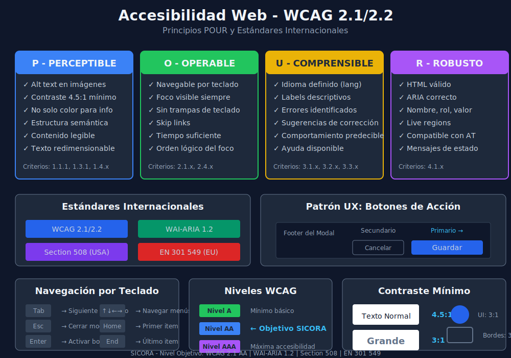

# Guía de Accesibilidad Web - SICORA

## 📋 Descripción General

SICORA implementa estándares de accesibilidad web internacionales para garantizar que la aplicación sea usable por todas las personas, incluyendo aquellas con discapacidades visuales, auditivas, motoras o cognitivas.



## 🎯 Estándares Implementados

### 1. WCAG 2.1/2.2 (Web Content Accessibility Guidelines)

**Nivel objetivo: AA** (Estándar recomendado)

| Nivel   | Descripción                     | Estado          |
| ------- | ------------------------------- | --------------- |
| **A**   | Requisitos mínimos básicos      | ✅ Implementado |
| **AA**  | Estándar recomendado (objetivo) | 🔄 En progreso  |
| **AAA** | Máxima accesibilidad            | ⏳ Parcial      |

### 2. WAI-ARIA (Accessible Rich Internet Applications)

Especificación para contenido web dinámico accesible:

- Roles semánticos (`role="dialog"`, `role="alert"`, etc.)
- Estados y propiedades (`aria-expanded`, `aria-selected`, etc.)
- Relaciones (`aria-labelledby`, `aria-describedby`, etc.)

### 3. Section 508 (USA)

Obligatorio para entidades gubernamentales estadounidenses. SICORA cumple con los requisitos técnicos.

### 4. EN 301 549 (Europa)

Estándar europeo de accesibilidad para productos y servicios TIC.

---

## 🔄 Los 4 Principios POUR

### P - Perceptible

El contenido debe ser presentado de manera que todos puedan percibirlo.

#### Criterios Implementados:

| Criterio   | Descripción          | Implementación                              |
| ---------- | -------------------- | ------------------------------------------- |
| **1.1.1**  | Texto alternativo    | Todas las imágenes tienen `alt` descriptivo |
| **1.3.1**  | Info y relaciones    | Estructura semántica HTML5                  |
| **1.4.1**  | Uso del color        | No solo color para transmitir info          |
| **1.4.3**  | Contraste mínimo     | Ratio 4.5:1 texto, 3:1 gráficos             |
| **1.4.4**  | Redimensionar texto  | Funcional hasta 200% zoom                   |
| **1.4.11** | Contraste no textual | Componentes UI visibles                     |

```tsx
// ✅ Correcto: Imagen con alt descriptivo


// ✅ Correcto: No depender solo del color
<Badge variant="success">
  <CheckIcon className="h-4 w-4 mr-1" />
  Aprobado
</Badge>

// ❌ Incorrecto: Solo color sin contexto
<span className="text-green-500">●</span>
```

### O - Operable

Los componentes de la interfaz deben ser operables por todos.

#### Criterios Implementados:

| Criterio  | Descripción           | Implementación                           |
| --------- | --------------------- | ---------------------------------------- |
| **2.1.1** | Teclado               | Toda funcionalidad accesible por teclado |
| **2.1.2** | Sin trampa de teclado | Navegación libre sin bloqueos            |
| **2.4.1** | Saltar bloques        | Skip links implementados                 |
| **2.4.3** | Orden del foco        | Secuencia lógica de navegación           |
| **2.4.4** | Propósito del enlace  | Enlaces descriptivos                     |
| **2.4.7** | Foco visible          | Indicador de foco claro                  |

```tsx
// ✅ Correcto: Indicador de foco visible
<button className="focus-visible:ring-2 focus-visible:ring-ring focus-visible:ring-offset-2">
  Guardar
</button>

// ✅ Correcto: Skip link
<a href="#main-content" className="sr-only focus:not-sr-only">
  Saltar al contenido principal
</a>

// ✅ Correcto: Enlace descriptivo
<a href="/usuarios/123">Ver perfil de Juan García</a>

// ❌ Incorrecto: Enlace genérico
<a href="/usuarios/123">Click aquí</a>
```

### U - Understandable (Comprensible)

La información debe ser comprensible para todos.

#### Criterios Implementados:

| Criterio  | Descripción               | Implementación           |
| --------- | ------------------------- | ------------------------ |
| **3.1.1** | Idioma de página          | `lang="es"` en HTML      |
| **3.2.1** | Al recibir foco           | Sin cambios inesperados  |
| **3.2.2** | Al recibir entrada        | Sin cambios automáticos  |
| **3.3.1** | Identificación de errores | Mensajes claros de error |
| **3.3.2** | Etiquetas o instrucciones | Labels descriptivos      |
| **3.3.3** | Sugerencia ante errores   | Ayuda para corregir      |

```tsx
// ✅ Correcto: Formulario con etiquetas y errores
<div>
  <label
    htmlFor="email"
    className="block text-sm font-medium">
    Correo Electrónico
  </label>
  <input
    id="email"
    type="email"
    aria-describedby="email-error"
    aria-invalid={!!error}
  />
  {error && (
    <p
      id="email-error"
      className="text-destructive text-sm mt-1"
      role="alert">
      {error}
    </p>
  )}
</div>
```

### R - Robust (Robusto)

El contenido debe funcionar en diversos navegadores y tecnologías asistivas.

#### Criterios Implementados:

| Criterio  | Descripción        | Implementación                    |
| --------- | ------------------ | --------------------------------- |
| **4.1.1** | Parsing            | HTML válido y bien formado        |
| **4.1.2** | Nombre, rol, valor | ARIA correcto en componentes      |
| **4.1.3** | Mensajes de estado | Live regions para actualizaciones |

```tsx
// ✅ Correcto: Componente con ARIA completo
<button
  role="switch"
  aria-checked={isActive}
  aria-label="Activar notificaciones"
  onClick={toggle}
>
  {isActive ? 'Activo' : 'Inactivo'}
</button>

// ✅ Correcto: Live region para mensajes
<div aria-live="polite" aria-atomic="true" className="sr-only">
  {statusMessage}
</div>
```

---

## 🎨 Patrones de Diseño UI/UX Accesibles

### Botones de Acción

#### Regla de Posicionamiento

> **Los botones que invitan a la acción (CTA) deben posicionarse a la derecha y tener mayor peso visual que los botones secundarios.**

```
┌─────────────────────────────────────────────────────────────┐
│                        Modal / Form                          │
│                                                              │
│  [Contenido del formulario]                                  │
│                                                              │
├─────────────────────────────────────────────────────────────┤
│                                                              │
│                    [Cancelar]  [■ Guardar]                   │
│                         ↑            ↑                       │
│                    Secundario    Primario                    │
│                    (outline)     (filled)                    │
│                    Izquierda     Derecha                     │
│                                                              │
└─────────────────────────────────────────────────────────────┘
```

#### Jerarquía Visual de Botones

| Tipo            | Variante  | Uso                         | Peso Visual          |
| --------------- | --------- | --------------------------- | -------------------- |
| **Primario**    | `primary` | Acción principal, CTA       | ████████ Alto        |
| **Secundario**  | `outline` | Acción secundaria, cancelar | ░░░░░░░░ Bajo        |
| **Terciario**   | `ghost`   | Acciones opcionales         | ░░░░ Mínimo          |
| **Destructivo** | `danger`  | Eliminar, confirmar peligro | ████████ Alto (rojo) |

```tsx
// ✅ Correcto: Footer de modal con jerarquía
<DialogFooter className="flex justify-end gap-3">
  <Button variant="outline" onClick={onCancel}>
    Cancelar
  </Button>
  <Button variant="primary" onClick={onConfirm}>
    Guardar Cambios
  </Button>
</DialogFooter>

// ✅ Correcto: Confirmación de eliminación
<DialogFooter className="flex justify-end gap-3">
  <Button variant="outline" onClick={onCancel}>
    No, mantener
  </Button>
  <Button variant="danger" onClick={onDelete}>
    Sí, eliminar
  </Button>
</DialogFooter>
```

### Formularios Accesibles

```tsx
// Estructura de campo accesible
<div className="space-y-2">
  {/* Label siempre visible */}
  <label
    htmlFor="nombre"
    className="block text-sm font-medium text-foreground">
    Nombre Completo
    {required && (
      <span
        className="text-destructive ml-1"
        aria-hidden="true">
        *
      </span>
    )}
  </label>

  {/* Input con atributos ARIA */}
  <input
    id="nombre"
    type="text"
    required={required}
    aria-required={required}
    aria-invalid={!!error}
    aria-describedby={error ? 'nombre-error' : hint ? 'nombre-hint' : undefined}
    className="..."
  />

  {/* Hint o instrucción */}
  {hint && (
    <p
      id="nombre-hint"
      className="text-sm text-muted-foreground">
      {hint}
    </p>
  )}

  {/* Mensaje de error */}
  {error && (
    <p
      id="nombre-error"
      className="text-sm text-destructive"
      role="alert">
      {error}
    </p>
  )}
</div>
```

### Navegación por Teclado

| Tecla             | Acción                                |
| ----------------- | ------------------------------------- |
| `Tab`             | Mover al siguiente elemento focusable |
| `Shift + Tab`     | Mover al elemento anterior            |
| `Enter` / `Space` | Activar botón o enlace                |
| `Escape`          | Cerrar modal/dropdown                 |
| `Arrow Keys`      | Navegar dentro de menús, tabs, etc.   |
| `Home` / `End`    | Ir al primer/último elemento          |

### Componentes con ARIA

#### Dialog/Modal

```tsx
<DialogPrimitive.Content
  role="dialog"
  aria-modal="true"
  aria-labelledby="dialog-title"
  aria-describedby="dialog-description">
  <DialogTitle id="dialog-title">Título del Modal</DialogTitle>
  <DialogDescription id="dialog-description">
    Descripción del contenido
  </DialogDescription>
  {/* Contenido */}
</DialogPrimitive.Content>
```

#### Dropdown Menu

```tsx
<button
  aria-haspopup="menu"
  aria-expanded={isOpen}
  aria-controls="menu-items"
>
  Opciones
</button>
<div
  id="menu-items"
  role="menu"
  aria-orientation="vertical"
>
  <button role="menuitem">Opción 1</button>
  <button role="menuitem">Opción 2</button>
</div>
```

#### Tabs

```tsx
<div role="tablist" aria-label="Configuración">
  <button
    role="tab"
    aria-selected={activeTab === 'general'}
    aria-controls="panel-general"
    id="tab-general"
  >
    General
  </button>
</div>
<div
  role="tabpanel"
  id="panel-general"
  aria-labelledby="tab-general"
  tabIndex={0}
>
  {/* Contenido del panel */}
</div>
```

#### Alertas y Notificaciones

```tsx
// Toast/Notificación
<div
  role="alert"
  aria-live="assertive"
  aria-atomic="true"
>
  <p>¡Usuario creado exitosamente!</p>
</div>

// Mensaje de estado (menos urgente)
<div
  role="status"
  aria-live="polite"
>
  <p>Guardando cambios...</p>
</div>
```

---

## 📏 Requisitos de Contraste

### Ratios Mínimos (WCAG AA)

| Elemento                          | Ratio Mínimo |
| --------------------------------- | ------------ |
| Texto normal (< 18px)             | 4.5:1        |
| Texto grande (≥ 18px o 14px bold) | 3:1          |
| Componentes UI (bordes, iconos)   | 3:1          |
| Elementos gráficos informativos   | 3:1          |

### Colores del Sistema

```css
/* Colores verificados para contraste */
:root {
  --foreground: #0f172a; /* Texto principal - Ratio: 15.5:1 */
  --muted-foreground: #64748b; /* Texto secundario - Ratio: 4.5:1 */
  --primary: #2563eb; /* Primario - Ratio: 4.7:1 */
  --destructive: #dc2626; /* Error - Ratio: 5.2:1 */

  /* Fondos */
  --background: #ffffff;
  --card: #f8fafc;
}
```

### Herramientas de Verificación

1. **WebAIM Contrast Checker**: https://webaim.org/resources/contrastchecker/
2. **Lighthouse** (Chrome DevTools)
3. **axe DevTools** (extensión)
4. **WAVE** (Web Accessibility Evaluation Tool)

---

## 🔧 Implementación en Componentes SICORA

### Button con Accesibilidad

```tsx
interface ButtonProps {
  variant?: 'primary' | 'secondary' | 'outline' | 'ghost' | 'danger';
  // ... otras props
  ariaLabel?: string; // Para botones solo con icono
}

const Button = React.forwardRef<HTMLButtonElement, ButtonProps>(
  ({ ariaLabel, children, ...props }, ref) => {
    return (
      <button
        ref={ref}
        aria-label={ariaLabel}
        aria-disabled={props.disabled}
        {...props}>
        {props.loading && <span className="sr-only">Cargando...</span>}
        {children}
      </button>
    );
  }
);
```

### Input con Accesibilidad

```tsx
interface InputProps {
  label: string;
  error?: string;
  hint?: string;
  required?: boolean;
}

const AccessibleInput = ({
  label,
  error,
  hint,
  required,
  ...props
}: InputProps) => {
  const id = useId();
  const errorId = `${id}-error`;
  const hintId = `${id}-hint`;

  return (
    <div>
      <label htmlFor={id}>
        {label}
        {required && <span aria-hidden="true"> *</span>}
      </label>

      <input
        id={id}
        aria-required={required}
        aria-invalid={!!error}
        aria-describedby={
          [error && errorId, hint && hintId].filter(Boolean).join(' ') ||
          undefined
        }
        {...props}
      />

      {hint && <p id={hintId}>{hint}</p>}
      {error && (
        <p
          id={errorId}
          role="alert">
          {error}
        </p>
      )}
    </div>
  );
};
```

---

## ✅ Checklist de Accesibilidad

### Estructura HTML

- [ ] Usar HTML semántico (`header`, `main`, `nav`, `footer`, `article`, `section`)
- [ ] Jerarquía de encabezados correcta (h1 → h2 → h3)
- [ ] Landmarks ARIA donde sea necesario
- [ ] Idioma definido (`lang="es"`)

### Imágenes y Media

- [ ] Todas las imágenes tienen `alt` descriptivo
- [ ] Imágenes decorativas tienen `alt=""`
- [ ] Videos con subtítulos disponibles
- [ ] Audio con transcripción

### Formularios

- [ ] Todos los campos tienen labels asociados
- [ ] Campos requeridos marcados con `aria-required`
- [ ] Errores con `role="alert"` y `aria-describedby`
- [ ] Grupos de campos con `fieldset` y `legend`

### Navegación

- [ ] Orden de tabulación lógico
- [ ] Skip links implementados
- [ ] Foco visible en todos los elementos interactivos
- [ ] No hay trampas de teclado

### Color y Contraste

- [ ] Contraste de texto cumple 4.5:1
- [ ] No se usa solo color para comunicar información
- [ ] Estados visuales claros (hover, focus, active, disabled)

### Componentes Interactivos

- [ ] Botones con roles y estados ARIA
- [ ] Modales con foco trapped
- [ ] Dropdowns con navegación por teclado
- [ ] Live regions para contenido dinámico

---

## 📚 Recursos Adicionales

- [WCAG 2.1 Guidelines](https://www.w3.org/TR/WCAG21/)
- [WAI-ARIA Practices](https://www.w3.org/WAI/ARIA/apg/)
- [MDN Accessibility](https://developer.mozilla.org/en-US/docs/Web/Accessibility)
- [A11y Project Checklist](https://www.a11yproject.com/checklist/)

---

_Guía de Accesibilidad Web - SICORA v1.0_
_Nivel objetivo: WCAG 2.1 AA_
