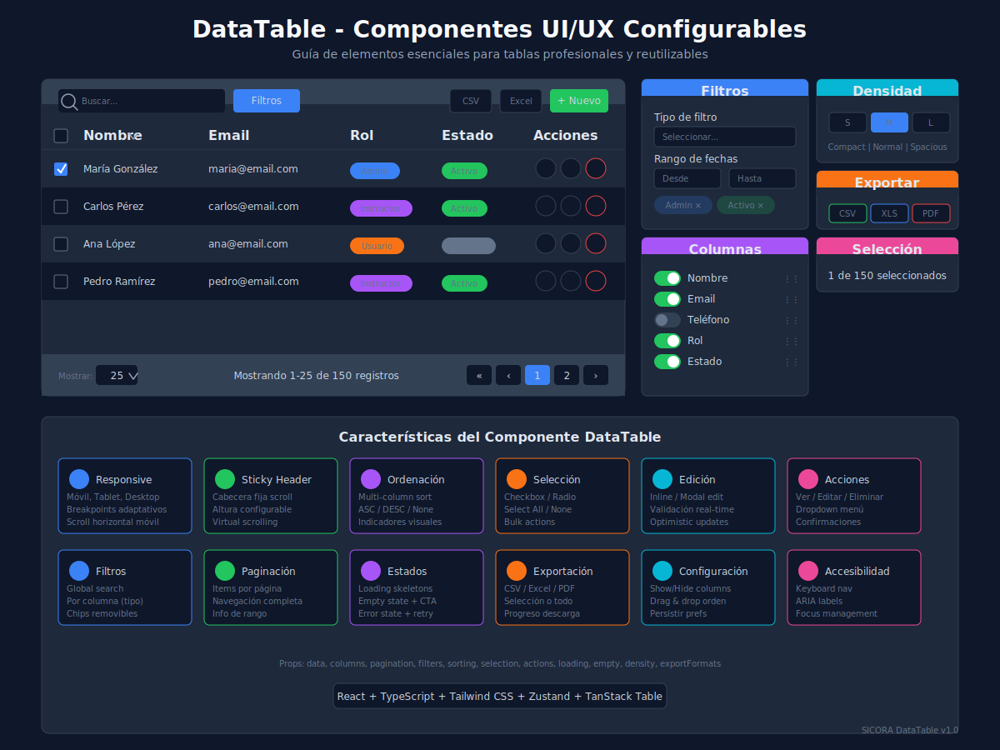

# Guía de Componentes DataTable UI/UX Configurables

## 📊 Visión General

Esta guía documenta los elementos esenciales y mejores prácticas para crear componentes de tabla profesionales y reutilizables en SICORA.



---

## 📋 1. Elementos Fundamentales de UI/UX

### 1.1 Estructura Visual y Layout

| Característica                | Descripción                         | Implementación              |
| ----------------------------- | ----------------------------------- | --------------------------- |
| **Responsive**                | Adaptable a móvil, tablet y desktop | Breakpoints: sm, md, lg, xl |
| **Densidad**                  | Compact, comfortable, spacious      | Prop `density`              |
| **Sticky Header**             | Cabecera fija al hacer scroll       | CSS `position: sticky`      |
| **Altura definida**           | Con scroll interno o paginación     | `maxHeight` prop            |
| **Columnas redimensionables** | Permitir ajustar ancho              | Resize handlers             |
| **Zebra striping**            | Filas alternadas para mejor lectura | `even:bg-muted/50`          |

### 1.2 Paginación

```typescript
interface PaginationConfig {
  enabled: boolean;
  pageSizes: number[]; // [10, 25, 50, 100]
  defaultPageSize: number; // 25
  showInfo: boolean; // "Mostrando 1-10 de 100"
  position: 'top' | 'bottom' | 'both';
}
```

**Elementos de UI:**

- Selector de items por página (dropdown)
- Navegación: Primera « | Anterior ‹ | Números | Siguiente › | Última »
- Info de rango: "Mostrando 1-10 de 100"
- Skeleton loading durante carga

### 1.3 Filtros

**Tipos de filtros por columna:**

| Tipo Dato   | Componente UI      | Comportamiento     |
| ----------- | ------------------ | ------------------ |
| **Text**    | Input con debounce | Búsqueda parcial   |
| **Number**  | Inputs min-max     | Rango numérico     |
| **Date**    | Date picker doble  | Rango de fechas    |
| **Select**  | Dropdown multi     | Selección múltiple |
| **Boolean** | Toggle/Checkbox    | Verdadero/Falso    |

**Elementos adicionales:**

- Global search: Búsqueda rápida en todas las columnas
- Filtros activos: Chips removibles
- Reset filters: Botón para limpiar todos

### 1.4 Ordenación

```typescript
interface SortConfig {
  enabled: boolean;
  multi: boolean; // Multi-column sorting (Shift + Click)
  defaultSort?: {
    column: string;
    direction: 'asc' | 'desc';
  };
}
```

**Indicadores visuales:**

- ↑ Ascendente
- ↓ Descendente
- Sin icono: Sin ordenar

### 1.5 Selección de Filas

```typescript
interface SelectionConfig {
  enabled: boolean;
  mode: 'single' | 'multiple';
  showSelectAll: boolean;
  onSelectionChange: (selectedIds: string[]) => void;
}
```

**Elementos de UI:**

- Checkbox en primera columna
- Select all/none en header
- Indicador de cantidad seleccionada
- Acciones bulk sobre seleccionadas

### 1.6 Edición

| Modo       | Descripción                | Uso Recomendado             |
| ---------- | -------------------------- | --------------------------- |
| **Inline** | Click en celda para editar | Ediciones rápidas simples   |
| **Modal**  | Formulario completo        | Edición de múltiples campos |
| **Drawer** | Panel lateral              | Edición con preview         |

**Estados de edición:**

- Editing: Celda en modo edición
- Saving: Guardando cambios
- Success: Guardado exitoso
- Error: Error con mensaje

### 1.7 Acciones por Fila

```typescript
interface RowAction<T> {
  id: string;
  label: string;
  icon?: React.ReactNode;
  onClick: (row: T) => void;
  isDestructive?: boolean;
  requireConfirmation?: boolean;
  isVisible?: (row: T) => boolean;
  isDisabled?: (row: T) => boolean;
}
```

**Patrones comunes:**

- Ver detalles
- Editar
- Duplicar
- Activar/Desactivar
- Eliminar (con confirmación)

### 1.8 Estados y Feedback

| Estado      | UI Element         | Descripción          |
| ----------- | ------------------ | -------------------- |
| **Loading** | Skeleton rows      | Mientras carga datos |
| **Empty**   | Ilustración + CTA  | Sin datos            |
| **Error**   | Alert + Retry      | Error de carga       |
| **Success** | Toast notification | Acción completada    |

### 1.9 Exportación

```typescript
interface ExportConfig {
  enabled: boolean;
  formats: ('csv' | 'excel' | 'pdf')[];
  exportSelection: boolean;
  exportAll: boolean;
  onExport: (format: string, data: unknown[]) => Promise<void>;
}
```

### 1.10 Configuración de Usuario

- Show/Hide columns (checkbox toggles)
- Reordenar columnas (drag & drop)
- Guardar preferencias (localStorage/API)
- Tema claro/oscuro

---

## 🏗️ 2. Arquitectura del Componente

### 2.1 Props Interface

```typescript
interface DataTableProps<T> {
  // Datos
  data: T[];
  columns: ColumnDef<T>[];
  keyField: keyof T;

  // Paginación
  pagination?: PaginationConfig;
  totalItems?: number;
  currentPage?: number;
  onPageChange?: (page: number) => void;
  onPageSizeChange?: (size: number) => void;

  // Filtros
  filters?: FilterConfig[];
  onFilterChange?: (filters: ActiveFilter[]) => void;
  globalSearch?: boolean;
  onSearch?: (query: string) => void;

  // Ordenación
  sorting?: SortConfig;
  onSortChange?: (sort: SortState[]) => void;

  // Selección
  selection?: SelectionConfig;
  selectedIds?: string[];
  onSelectionChange?: (ids: string[]) => void;

  // Acciones
  rowActions?: RowAction<T>[];
  bulkActions?: BulkAction<T>[];

  // Estados
  isLoading?: boolean;
  error?: string | null;
  emptyState?: React.ReactNode;

  // Configuración visual
  density?: 'compact' | 'normal' | 'spacious';
  stickyHeader?: boolean;
  maxHeight?: string | number;
  zebraStripes?: boolean;

  // Exportación
  export?: ExportConfig;

  // Personalización
  className?: string;
  headerClassName?: string;
  rowClassName?: (row: T, index: number) => string;
}
```

### 2.2 Column Definition

```typescript
interface ColumnDef<T> {
  id: string;
  header: string | React.ReactNode;
  accessorKey?: keyof T;
  accessorFn?: (row: T) => unknown;

  // Renderizado
  cell?: (info: CellContext<T>) => React.ReactNode;

  // Configuración
  sortable?: boolean;
  filterable?: boolean;
  filterType?: 'text' | 'number' | 'date' | 'select' | 'boolean';
  filterOptions?: { value: string; label: string }[];

  // Layout
  width?: string | number;
  minWidth?: string | number;
  maxWidth?: string | number;
  align?: 'left' | 'center' | 'right';

  // Visibilidad
  defaultVisible?: boolean;
  hideable?: boolean;
}
```

---

## 🎨 3. Estilos y Clases CSS

### 3.1 Variables de Densidad

```css
/* Compact */
--table-row-height: 36px;
--table-cell-padding: 8px 12px;
--table-font-size: 12px;

/* Normal */
--table-row-height: 48px;
--table-cell-padding: 12px 16px;
--table-font-size: 14px;

/* Spacious */
--table-row-height: 60px;
--table-cell-padding: 16px 20px;
--table-font-size: 14px;
```

### 3.2 Clases Tailwind Base

```tsx
// Container
'bg-card rounded-lg border border-border overflow-hidden';

// Header
'bg-muted/50 sticky top-0 z-10';

// Header cell
'px-4 py-3 text-left text-sm font-medium text-muted-foreground';

// Body row
'border-b border-border hover:bg-muted/50 transition-colors';

// Body cell
'px-4 py-3 text-sm text-foreground';

// Zebra stripe
'even:bg-muted/30';

// Selected row
'bg-primary/10 border-primary/20';
```

---

## 📱 4. Responsive Design

### 4.1 Breakpoints

| Breakpoint          | Comportamiento                           |
| ------------------- | ---------------------------------------- |
| **< 640px (sm)**    | Scroll horizontal, columnas prioritarias |
| **640-768px (md)**  | Ocultar columnas secundarias             |
| **768-1024px (lg)** | Mostrar más columnas                     |
| **> 1024px (xl)**   | Layout completo                          |

### 4.2 Mobile Patterns

1. **Horizontal Scroll**: Tabla con scroll horizontal
2. **Card View**: Convertir filas en cards
3. **Collapsible Details**: Expandir fila para ver detalles
4. **Priority Columns**: Solo mostrar columnas esenciales

---

## ♿ 5. Accesibilidad (A11y)

### 5.1 Requisitos WCAG

- [ ] Navegación por teclado (Tab, Arrow keys, Enter, Escape)
- [ ] ARIA labels en todos los elementos interactivos
- [ ] Focus visible en filas y celdas
- [ ] Anuncios de cambio de página para screen readers
- [ ] Contraste de colores adecuado
- [ ] Texto alternativo en iconos

### 5.2 Atributos ARIA

```tsx
<table
  role="grid"
  aria-label="Lista de usuarios">
  <thead role="rowgroup">
    <tr role="row">
      <th
        role="columnheader"
        aria-sort="ascending">
        Nombre
      </th>
    </tr>
  </thead>
  <tbody role="rowgroup">
    <tr
      role="row"
      aria-selected="false">
      <td role="gridcell">María González</td>
    </tr>
  </tbody>
</table>
```

---

## 🧪 6. Testing

### 6.1 Test Cases Esenciales

```typescript
describe('DataTable', () => {
  // Renderizado
  it('renders with data correctly');
  it('renders empty state when no data');
  it('renders loading skeleton');
  it('renders error state with retry');

  // Paginación
  it('changes page on click');
  it('changes page size');
  it('disables prev/next at boundaries');

  // Ordenación
  it('sorts column on header click');
  it('toggles sort direction');
  it('supports multi-column sort');

  // Filtros
  it('filters data with global search');
  it('filters by column');
  it('clears all filters');

  // Selección
  it('selects single row');
  it('selects all rows');
  it('deselects all rows');

  // Acciones
  it('triggers row action on click');
  it('shows confirmation for destructive action');

  // Accesibilidad
  it('navigates with keyboard');
  it('has proper ARIA attributes');
});
```

---

## 📚 7. Referencias

- [TanStack Table v8](https://tanstack.com/table/v8)
- [Radix UI Primitives](https://www.radix-ui.com/)
- [WAI-ARIA Table Pattern](https://www.w3.org/WAI/ARIA/apg/patterns/table/)
- [Material Design Data Tables](https://material.io/components/data-tables)

---

## 🔗 Archivos Relacionados

- Componente: `src/components/ui/DataTable/`
- Types: `src/types/datatable.types.ts`
- Hooks: `src/hooks/useDataTable.ts`
- Store: `src/stores/datatable.store.ts`

---

_Última actualización: Enero 2026_
_Versión: 1.0_
