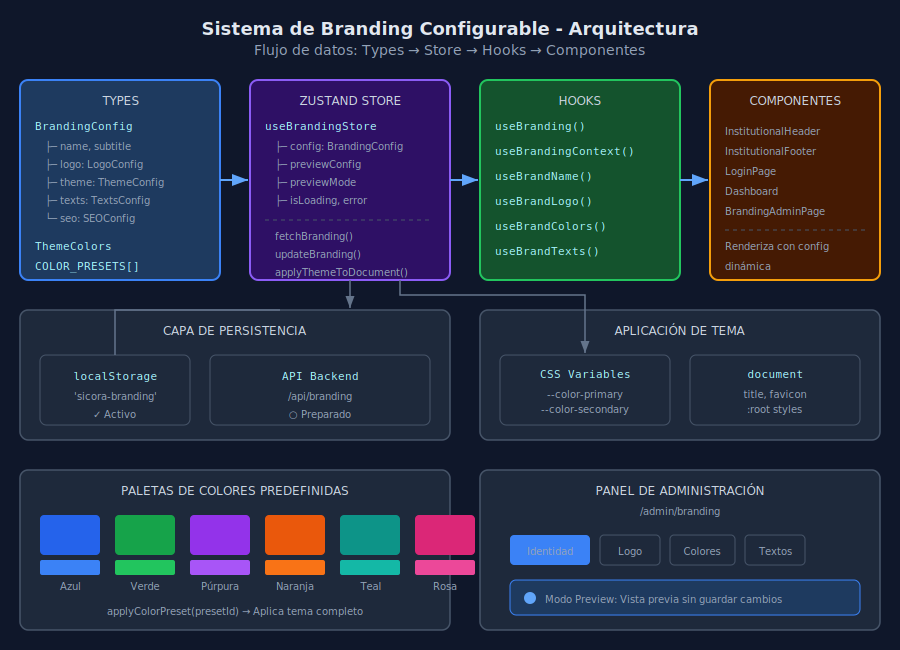

# Sistema de Branding Configurable - SICORA

## 📋 Descripción General

SICORA implementa un sistema de branding completamente configurable que permite a los administradores personalizar:

- **Nombre del Sistema**: El título que aparece en headers, login y título del navegador
- **Logo**: Logos para diferentes contextos (principal, tema oscuro, favicon, pequeño)
- **Paleta de Colores**: Temas predefinidos o colores personalizados
- **Textos**: Mensajes de bienvenida, subtítulos, footer, copyright

## 🏗️ Arquitectura



### Estructura de Archivos

```
src/
├── types/
│   └── branding.types.ts      # Tipos e interfaces
├── stores/
│   └── branding.store.ts      # Zustand store con persistencia
├── hooks/
│   └── useBranding.ts         # Hooks de consumo
├── lib/api/
│   └── branding.ts            # Cliente API (preparado)
└── pages/admin/
    └── BrandingAdminPage.tsx  # Panel de administración
```

## 📐 Tipos Principales

### BrandingConfig

```typescript
interface BrandingConfig {
  // Identidad
  name: string; // Nombre del sistema
  subtitle: string; // Subtítulo descriptivo
  description: string; // Descripción completa
  organization: string; // Nombre corto de organización
  organizationFull: string; // Nombre completo
  contactEmail: string;

  // Logo
  logo: {
    primary: string; // Logo principal (URL o base64)
    dark?: string; // Logo para tema oscuro
    small?: string; // Logo compacto para navbar
    favicon?: string; // Favicon del sitio
    showInHeader: boolean;
    showInFooter: boolean;
  };

  // Tema de colores
  theme: {
    name: string; // Nombre del tema activo
    light: ThemeColors; // Colores modo claro
    dark: ThemeColors; // Colores modo oscuro
  };

  // Textos personalizables
  texts: {
    welcomeMessage: string;
    loginSubtitle: string;
    dashboardTitle: string;
    footerText: string;
    copyright: string; // Usa {year} para año dinámico
  };

  // SEO
  seo: {
    title?: string;
    description?: string;
    keywords?: string[];
  };
}
```

### ThemeColors

```typescript
interface ThemeColors {
  primary: string; // Color principal
  primaryForeground: string;
  secondary: string; // Color secundario
  secondaryForeground: string;
  destructive: string; // Acciones destructivas
  destructiveForeground: string;
  accent: string; // Acentos
  accentForeground: string;
  success: string; // Estados exitosos
  warning: string; // Advertencias
  info: string; // Información
}
```

## 🎨 Paletas de Colores Predefinidas

| Paleta                 | Primary | Secondary | Accent  |
| ---------------------- | ------- | --------- | ------- |
| **Azul Institucional** | #2563eb | #3b82f6   | #60a5fa |
| **Verde Natura**       | #16a34a | #22c55e   | #4ade80 |
| **Púrpura Moderno**    | #9333ea | #a855f7   | #c084fc |
| **Naranja Energía**    | #ea580c | #f97316   | #fb923c |
| **Teal Profesional**   | #0d9488 | #14b8a6   | #2dd4bf |
| **Rosa Dinámico**      | #db2777 | #ec4899   | #f472b6 |

## 🔧 Uso en Componentes

### Hook Principal: useBrandingContext

```typescript
import { useBrandingContext } from '@/hooks/useBranding';

function MyComponent() {
  const {
    name, // "SICORA"
    subtitle, // "Coordinación Académica"
    logo, // URL del logo principal
    primaryColor, // "#2563eb"
    texts, // Textos personalizados
    getPageTitle, // Helper para títulos
  } = useBrandingContext();

  return (
    <header>
      
      <h1>{name}</h1>
    </header>
  );
}
```

### Hooks Especializados

```typescript
// Solo nombre
const brandName = useBrandName();

// Solo logo (con soporte tema oscuro)
const logoUrl = useBrandLogo(preferDark);

// Solo colores
const colors = useBrandColors();

// Solo textos (con copyright procesado)
const { welcomeMessage, copyright } = useBrandTexts();

// Para SEO
const { title, description, keywords } = useBrandSeo();
```

## 🛠️ Panel de Administración

Ruta: `/admin/branding`

### Características

1. **Tabs de Configuración**:

   - **Identidad**: Nombre, subtítulo, descripción, organización
   - **Logo**: Upload/URL de logos para diferentes contextos
   - **Colores**: Paletas predefinidas + personalización manual
   - **Textos**: Mensajes del sistema editables

2. **Vista Previa en Tiempo Real**:

   - Modo preview activa cambios sin guardar
   - Botones de aplicar/cancelar preview

3. **Persistencia**:
   - Almacenamiento en localStorage
   - Preparado para API backend

## 📦 Persistencia de Datos

### localStorage (Actual)

```javascript
// Clave: 'sicora-branding'
// Estructura: BrandingConfig serializado
```

### API Backend (Preparado)

```typescript
// Endpoints preparados en src/lib/api/branding.ts:
GET    /api/branding           // Obtener configuración
PUT    /api/branding           // Actualizar configuración
POST   /api/branding/logo      // Subir logo
DELETE /api/branding/logo/:type // Eliminar logo
POST   /api/branding/reset     // Resetear a defaults
GET    /api/branding/export    // Exportar JSON
POST   /api/branding/import    // Importar JSON
```

## 🔄 Flujo de Aplicación de Tema

```
1. App Mount
   └─> useBrandingStore.fetchBranding()
       └─> Cargar desde localStorage
           └─> applyThemeToDocument()
               ├─> CSS Custom Properties
               ├─> document.title
               └─> favicon

2. Usuario cambia color
   └─> setThemeColors()
       └─> updateBranding() o previewChanges()
           └─> applyThemeToDocument()

3. Preview Mode
   └─> setPreviewMode(true)
       └─> previewChanges(data)
           └─> Aplicar visualmente
       └─> applyPreview() | cancelPreview()
```

## ⚙️ Variables CSS Aplicadas

```css
:root {
  --color-primary: #2563eb;
  --color-primary-foreground: #ffffff;
  --color-secondary: #64748b;
  --color-secondary-foreground: #ffffff;
  --color-destructive: #ef4444;
  --color-destructive-foreground: #ffffff;
  --color-accent: #60a5fa;
  --color-accent-foreground: #1e3a5f;
  --color-success: #22c55e;
  --color-warning: #f59e0b;
  --color-info: #3b82f6;
}
```

## 🚀 Migración desde BRAND_CONFIG

### Antes (Hardcoded)

```typescript
import { BRAND_CONFIG } from '@/config/brand';

function Header() {
  return <h1>{BRAND_CONFIG.name}</h1>;
}
```

### Después (Dinámico)

```typescript
import { useBrandingContext } from '@/hooks/useBranding';

function Header() {
  const { name } = useBrandingContext();
  return <h1>{name}</h1>;
}
```

## 📝 Checklist de Implementación

- [x] Tipos e interfaces de branding
- [x] Store Zustand con persistencia
- [x] Hooks de consumo
- [x] Cliente API preparado
- [x] Página de administración
- [x] Integración en LoginPage
- [x] Integración en Dashboard
- [x] Integración en InstitutionalHeader
- [ ] Integración en InstitutionalFooter
- [ ] Integración en páginas restantes
- [ ] Upload de logos (backend)
- [ ] Sincronización multi-tenant

## 🔐 Permisos Requeridos

- Solo usuarios con rol `admin` pueden acceder a `/admin/branding`
- Implementar ProtectedRoute con validación de rol

---

_Documentación del Sistema de Branding Configurable - SICORA v1.0_
