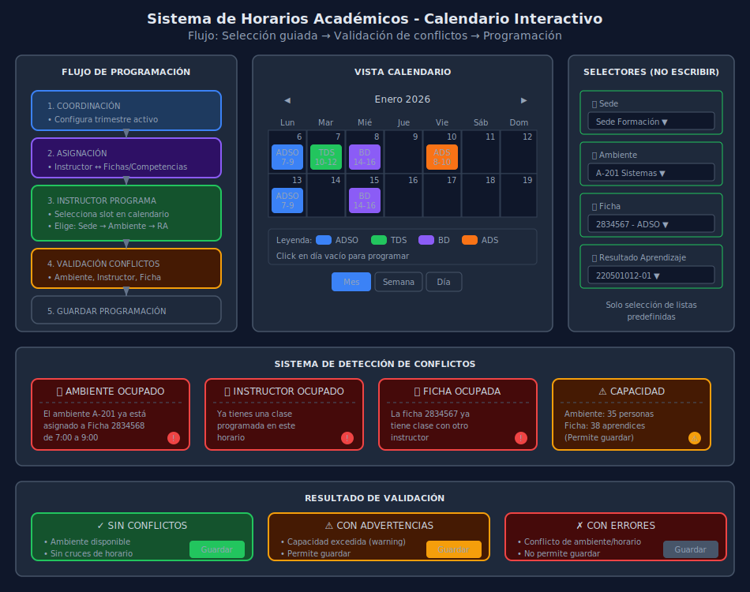

# Sistema de Horarios Académicos - SICORA

## 📋 Descripción General

El módulo de Horarios de SICORA implementa un **calendario interactivo tipo Google Calendar** que permite a los instructores programar sus actividades de formación trimestralmente. El sistema incluye:

- **Detección automática de conflictos** (ambiente, instructor, ficha)
- **Selección guiada** sin escritura libre (sede, ambiente, resultado de aprendizaje)
- **Validación de disponibilidad** en tiempo real
- **Vista calendario** con múltiples perspectivas (día, semana, mes)



## 🏗️ Arquitectura del Sistema

### Flujo de Programación

```
┌─────────────────────────────────────────────────────────────────────┐
│                    COORDINACIÓN ACADÉMICA                           │
│  ┌─────────────────────────────────────────────────────────────┐    │
│  │ 1. Configura trimestre activo                                │    │
│  │ 2. Asigna instructores a fichas/programas                    │    │
│  │ 3. Define disponibilidad de ambientes                        │    │
│  │ 4. Genera PDF de horario marco por instructor                │    │
│  └─────────────────────────────────────────────────────────────┘    │
└─────────────────────────────────────────────────────────────────────┘
                                   │
                                   ▼
┌─────────────────────────────────────────────────────────────────────┐
│                         INSTRUCTOR                                  │
│  ┌─────────────────────────────────────────────────────────────┐    │
│  │ 1. Accede al calendario trimestral                           │    │
│  │ 2. Selecciona slot de tiempo disponible                      │    │
│  │ 3. Selecciona (sin escribir):                                │    │
│  │    - Sede (predefinida por coordinación)                     │    │
│  │    - Ambiente (filtrado por disponibilidad)                  │    │
│  │    - Resultado de Aprendizaje (del programa asignado)        │    │
│  │ 4. Sistema valida conflictos automáticamente                 │    │
│  │ 5. Guarda o cancela programación                             │    │
│  └─────────────────────────────────────────────────────────────┘    │
└─────────────────────────────────────────────────────────────────────┘
                                   │
                                   ▼
┌─────────────────────────────────────────────────────────────────────┐
│                    DETECCIÓN DE CONFLICTOS                          │
│  ┌──────────────────┐ ┌──────────────────┐ ┌──────────────────┐     │
│  │ 🏢 Ambiente      │ │ 👤 Instructor    │ │ 📚 Ficha         │     │
│  │ ¿Ya asignado?    │ │ ¿Ya tiene clase? │ │ ¿Ya tiene clase? │     │
│  └──────────────────┘ └──────────────────┘ └──────────────────┘     │
└─────────────────────────────────────────────────────────────────────┘
```

## 📐 Modelo de Datos Extendido

### Entidades Principales

```typescript
// Trimestre académico
interface AcademicQuarter {
  id: string;
  year: number;
  quarter: 1 | 2 | 3 | 4; // Q1: Ene-Mar, Q2: Abr-Jun, etc.
  start_date: string;
  end_date: string;
  is_active: boolean;
  scheduling_open: boolean; // Permite programación
  scheduling_deadline: string; // Fecha límite para programar
}

// Sede de formación
interface Sede {
  id: string;
  code: string;
  name: string; // "Sede Formación", "Centro Principal"
  address: string;
  city: string;
  is_active: boolean;
}

// Ambiente de formación
interface Ambiente {
  id: string;
  sede_id: string;
  code: string; // "A-201", "LAB-INFO-01"
  name: string; // "Aula 201", "Laboratorio Informática 1"
  type: AmbienteType;
  capacity: number;
  equipment: string[]; // ["Proyector", "PCs", "Internet"]
  is_active: boolean;
}

type AmbienteType =
  | 'aula' // Aula tradicional
  | 'laboratorio' // Laboratorio especializado
  | 'taller' // Taller práctico
  | 'auditorio' // Espacio grande
  | 'virtual'; // Sesión virtual/remota

// Programa de formación
interface ProgramaFormacion {
  id: string;
  code: string; // "228106"
  name: string; // "Análisis y Desarrollo de Software"
  level: ProgramLevel;
  duration_months: number;
  competencias: Competencia[];
}

type ProgramLevel = 'tecnologo' | 'tecnico' | 'auxiliar' | 'especializacion';

// Competencia de aprendizaje
interface Competencia {
  id: string;
  programa_id: string;
  code: string; // "220501012"
  name: string; // "Construir el sistema..."
  resultados_aprendizaje: ResultadoAprendizaje[];
}

// Resultado de aprendizaje (lo que selecciona el instructor)
interface ResultadoAprendizaje {
  id: string;
  competencia_id: string;
  code: string; // "220501012-01"
  description: string; // "Interpretar el informe..."
  hours_theory: number;
  hours_practice: number;
  hours_total: number;
}

// Ficha de formación (grupo de aprendices)
interface Ficha {
  id: string;
  code: string; // "2834567"
  programa_id: string;
  programa_name: string;
  instructor_lider_id: string;
  start_date: string;
  end_date: string;
  current_quarter: number;
  aprendices_count: number;
  status: 'en_formacion' | 'finalizada' | 'cancelada';
}

// Asignación instructor-ficha (por trimestre)
interface InstructorFichaAssignment {
  id: string;
  instructor_id: string;
  ficha_id: string;
  quarter_id: string;
  competencias_asignadas: string[]; // IDs de competencias
  hours_assigned: number;
  is_lider: boolean;
}
```

### Modelo de Horario Extendido

```typescript
// Evento de horario (programación)
interface ScheduleEvent {
  id: string;

  // Contexto temporal
  quarter_id: string;
  date: string; // YYYY-MM-DD
  start_time: string; // HH:MM
  end_time: string; // HH:MM

  // Asignaciones (SOLO selección, no escritura)
  instructor_id: string;
  ficha_id: string;
  sede_id: string;
  ambiente_id: string;
  resultado_aprendizaje_id: string;

  // Datos calculados/denormalizados para display
  instructor_name: string;
  ficha_code: string;
  sede_name: string;
  ambiente_name: string;
  resultado_description: string;
  competencia_name: string;
  programa_name: string;

  // Metadatos
  status: ScheduleEventStatus;
  recurrence: RecurrenceConfig | null;
  created_by: string;
  created_at: string;
  updated_at: string;

  // Validación
  conflicts: ConflictInfo[];
  is_validated: boolean;
}

type ScheduleEventStatus =
  | 'draft' // Borrador, no confirmado
  | 'scheduled' // Programado y validado
  | 'in_progress' // En curso
  | 'completed' // Finalizado
  | 'cancelled'; // Cancelado

interface RecurrenceConfig {
  type: 'daily' | 'weekly' | 'biweekly';
  days_of_week?: DayOfWeek[]; // Para weekly
  end_date: string;
  exceptions: string[]; // Fechas excluidas
}
```

## 🔍 Sistema de Detección de Conflictos

### Tipos de Conflicto

```typescript
interface ConflictInfo {
  type: ConflictType;
  severity: 'error' | 'warning';
  message: string;
  conflicting_event_id?: string;
  details: ConflictDetails;
}

type ConflictType =
  | 'ambiente_ocupado' // El ambiente ya tiene evento
  | 'instructor_ocupado' // El instructor ya tiene clase
  | 'ficha_ocupada' // La ficha ya tiene clase
  | 'capacidad_excedida' // Ambiente muy pequeño
  | 'fuera_horario' // Fuera de jornada permitida
  | 'sede_diferente'; // Instructor en otra sede

interface ConflictDetails {
  // Para ambiente_ocupado
  existing_event?: {
    id: string;
    instructor_name: string;
    ficha_code: string;
    time_range: string;
  };

  // Para capacidad_excedida
  ambiente_capacity?: number;
  ficha_size?: number;

  // Para fuera_horario
  allowed_hours?: {
    start: string;
    end: string;
  };
}
```

### Algoritmo de Validación

```typescript
async function validateScheduleEvent(
  event: CreateScheduleEventRequest,
  existingEvents: ScheduleEvent[]
): Promise<ConflictInfo[]> {
  const conflicts: ConflictInfo[] = [];

  // 1. Validar ambiente disponible
  const ambienteConflicts = existingEvents.filter(
    (e) =>
      e.ambiente_id === event.ambiente_id &&
      e.date === event.date &&
      hasTimeOverlap(e, event)
  );

  if (ambienteConflicts.length > 0) {
    conflicts.push({
      type: 'ambiente_ocupado',
      severity: 'error',
      message: `El ambiente ya está asignado a ${ambienteConflicts[0].ficha_code}`,
      conflicting_event_id: ambienteConflicts[0].id,
      details: {
        existing_event: {
          id: ambienteConflicts[0].id,
          instructor_name: ambienteConflicts[0].instructor_name,
          ficha_code: ambienteConflicts[0].ficha_code,
          time_range: `${ambienteConflicts[0].start_time} - ${ambienteConflicts[0].end_time}`,
        },
      },
    });
  }

  // 2. Validar instructor disponible
  const instructorConflicts = existingEvents.filter(
    (e) =>
      e.instructor_id === event.instructor_id &&
      e.date === event.date &&
      hasTimeOverlap(e, event)
  );

  if (instructorConflicts.length > 0) {
    conflicts.push({
      type: 'instructor_ocupado',
      severity: 'error',
      message: 'Ya tienes una clase programada en este horario',
      conflicting_event_id: instructorConflicts[0].id,
      details: { existing_event: instructorConflicts[0] },
    });
  }

  // 3. Validar ficha disponible
  const fichaConflicts = existingEvents.filter(
    (e) =>
      e.ficha_id === event.ficha_id &&
      e.date === event.date &&
      hasTimeOverlap(e, event)
  );

  if (fichaConflicts.length > 0) {
    conflicts.push({
      type: 'ficha_ocupada',
      severity: 'error',
      message: `La ficha ${event.ficha_id} ya tiene clase con otro instructor`,
      conflicting_event_id: fichaConflicts[0].id,
      details: { existing_event: fichaConflicts[0] },
    });
  }

  // 4. Validar capacidad del ambiente
  const ambiente = await getAmbiente(event.ambiente_id);
  const ficha = await getFicha(event.ficha_id);

  if (ambiente.capacity < ficha.aprendices_count) {
    conflicts.push({
      type: 'capacidad_excedida',
      severity: 'warning',
      message: `El ambiente tiene capacidad para ${ambiente.capacity} pero la ficha tiene ${ficha.aprendices_count} aprendices`,
      details: {
        ambiente_capacity: ambiente.capacity,
        ficha_size: ficha.aprendices_count,
      },
    });
  }

  return conflicts;
}

function hasTimeOverlap(event1: TimeRange, event2: TimeRange): boolean {
  const start1 = parseTime(event1.start_time);
  const end1 = parseTime(event1.end_time);
  const start2 = parseTime(event2.start_time);
  const end2 = parseTime(event2.end_time);

  return start1 < end2 && start2 < end1;
}
```

## 🎨 Componente Calendar

### Vista Principal

```
┌──────────────────────────────────────────────────────────────────────────┐
│  ◀ Enero 2026 ▶                          [Día] [Semana] [Mes] [Agenda]  │
├──────────────────────────────────────────────────────────────────────────┤
│  Lun    Mar    Mié    Jue    Vie    Sáb    Dom                          │
├────────┬────────┬────────┬────────┬────────┬────────┬────────┤
│        │        │   1    │   2    │   3    │   4    │   5    │
│        │        │        │        │        │        │        │
├────────┼────────┼────────┼────────┼────────┼────────┼────────┤
│   6    │   7    │   8    │   9    │  10    │  11    │  12    │
│ ┌────┐ │ ┌────┐ │ ┌────┐ │        │ ┌────┐ │        │        │
│ │ 🟦 │ │ │ 🟩 │ │ │ 🟦 │ │        │ │ 🟨 │ │        │        │
│ │ADSO│ │ │ADSO│ │ │ADSO│ │        │ │TDS │ │        │        │
│ │7-9 │ │ │10-12│ │ │7-9 │ │        │ │2-4 │ │        │        │
│ └────┘ │ └────┘ │ └────┘ │        │ └────┘ │        │        │
│ ┌────┐ │        │        │        │        │        │        │
│ │ 🟪 │ │        │        │        │        │        │        │
│ │TGS │ │        │        │        │        │        │        │
│ │10-12│ │        │        │        │        │        │        │
│ └────┘ │        │        │        │        │        │        │
├────────┼────────┼────────┼────────┼────────┼────────┼────────┤
│  ...   │  ...   │  ...   │  ...   │  ...   │  ...   │  ...   │
└────────┴────────┴────────┴────────┴────────┴────────┴────────┘
```

### Modal de Creación de Evento

```
┌─────────────────────────────────────────────────────────────┐
│  Programar Actividad de Formación              [✕]         │
├─────────────────────────────────────────────────────────────┤
│                                                             │
│  📅 Fecha y Hora                                            │
│  ┌─────────────────────────────────────────────────────┐    │
│  │ Martes, 7 de Enero 2026                             │    │
│  │ Hora inicio: [07:00 ▼]  Hora fin: [09:00 ▼]        │    │
│  └─────────────────────────────────────────────────────┘    │
│                                                             │
│  🏢 Ubicación                                               │
│  ┌─────────────────────────────────────────────────────┐    │
│  │ Sede: [Sede Formación ▼]                            │    │
│  │ Ambiente: [A-201 - Aula Sistemas ▼]                 │    │
│  │ Capacidad: 35 personas  ✓ Disponible                │    │
│  └─────────────────────────────────────────────────────┘    │
│                                                             │
│  📚 Actividad de Formación                                  │
│  ┌─────────────────────────────────────────────────────┐    │
│  │ Ficha: [2834567 - ADSO ▼]                           │    │
│  │ Competencia: [220501012 - Construir el sistema... ▼]│    │
│  │ Resultado: [220501012-01 - Interpretar el informe...▼│   │
│  │ Horas teóricas: 2h  |  Horas prácticas: 0h          │    │
│  └─────────────────────────────────────────────────────┘    │
│                                                             │
│  🔄 Recurrencia                                             │
│  ┌─────────────────────────────────────────────────────┐    │
│  │ [x] Repetir semanalmente                            │    │
│  │ Días: [x]Lun [ ]Mar [x]Mié [ ]Jue [ ]Vie           │    │
│  │ Hasta: [31/03/2026]                                 │    │
│  └─────────────────────────────────────────────────────┘    │
│                                                             │
│  ⚠️ Validación                                              │
│  ┌─────────────────────────────────────────────────────┐    │
│  │ ✓ Ambiente disponible                               │    │
│  │ ✓ Sin conflictos de horario                         │    │
│  │ ⚠ Capacidad: 35 < 38 aprendices (advertencia)      │    │
│  └─────────────────────────────────────────────────────┘    │
│                                                             │
│           [Cancelar]              [Guardar Programación]    │
└─────────────────────────────────────────────────────────────┘
```

## 🔧 Implementación Frontend

### Estructura de Archivos

```
src/
├── types/
│   └── schedule.types.ts           # Tipos extendidos
├── lib/api/
│   └── schedules.ts                # Cliente API
├── stores/
│   └── schedules.store.ts          # Zustand store
├── hooks/
│   ├── useSchedules.ts             # Hook principal
│   ├── useScheduleConflicts.ts     # Validación de conflictos
│   └── useScheduleCalendar.ts      # Lógica del calendario
├── components/
│   └── schedules/
│       ├── ScheduleCalendar.tsx    # Componente calendario principal
│       ├── CalendarHeader.tsx      # Navegación mes/semana
│       ├── CalendarGrid.tsx        # Grid de días/horas
│       ├── EventCard.tsx           # Tarjeta de evento
│       ├── EventModal.tsx          # Modal crear/editar
│       ├── ConflictAlert.tsx       # Alertas de conflicto
│       ├── LocationSelector.tsx    # Selector sede/ambiente
│       └── ActivitySelector.tsx    # Selector RA/Competencia
└── pages/
    └── horarios/
        └── HorariosPage.tsx        # Página principal
```

### Selector de Actividad (Sin escritura)

```typescript
interface ActivitySelectorProps {
  instructorId: string;
  quarterId: string;
  selectedFichaId?: string;
  selectedCompetenciaId?: string;
  selectedResultadoId?: string;
  onFichaChange: (fichaId: string) => void;
  onCompetenciaChange: (competenciaId: string) => void;
  onResultadoChange: (resultadoId: string) => void;
}

function ActivitySelector({
  instructorId,
  quarterId,
  selectedFichaId,
  selectedCompetenciaId,
  selectedResultadoId,
  onFichaChange,
  onCompetenciaChange,
  onResultadoChange,
}: ActivitySelectorProps) {
  // Obtener fichas asignadas al instructor en el trimestre
  const { fichas, isLoading: loadingFichas } = useInstructorFichas(
    instructorId,
    quarterId
  );

  // Obtener competencias de la ficha seleccionada
  const { competencias, isLoading: loadingCompetencias } =
    useFichaCompetencias(selectedFichaId);

  // Obtener resultados de la competencia seleccionada
  const { resultados, isLoading: loadingResultados } = useCompetenciaResultados(
    selectedCompetenciaId
  );

  return (
    <div className="space-y-4">
      {/* Selector de Ficha */}
      <div>
        <Label>Ficha de Formación</Label>
        <Select
          value={selectedFichaId}
          onValueChange={onFichaChange}
          disabled={loadingFichas}>
          <SelectTrigger>
            <SelectValue placeholder="Seleccione una ficha..." />
          </SelectTrigger>
          <SelectContent>
            {fichas.map((ficha) => (
              <SelectItem
                key={ficha.id}
                value={ficha.id}>
                {ficha.code} - {ficha.programa_name}
              </SelectItem>
            ))}
          </SelectContent>
        </Select>
      </div>

      {/* Selector de Competencia */}
      <div>
        <Label>Competencia</Label>
        <Select
          value={selectedCompetenciaId}
          onValueChange={onCompetenciaChange}
          disabled={!selectedFichaId || loadingCompetencias}>
          <SelectTrigger>
            <SelectValue placeholder="Seleccione competencia..." />
          </SelectTrigger>
          <SelectContent>
            {competencias.map((comp) => (
              <SelectItem
                key={comp.id}
                value={comp.id}>
                {comp.code} - {comp.name}
              </SelectItem>
            ))}
          </SelectContent>
        </Select>
      </div>

      {/* Selector de Resultado de Aprendizaje */}
      <div>
        <Label>Resultado de Aprendizaje</Label>
        <Select
          value={selectedResultadoId}
          onValueChange={onResultadoChange}
          disabled={!selectedCompetenciaId || loadingResultados}>
          <SelectTrigger>
            <SelectValue placeholder="Seleccione resultado..." />
          </SelectTrigger>
          <SelectContent>
            {resultados.map((ra) => (
              <SelectItem
                key={ra.id}
                value={ra.id}>
                <div className="flex flex-col">
                  <span>{ra.code}</span>
                  <span className="text-xs text-muted-foreground">
                    {ra.description.substring(0, 50)}...
                  </span>
                  <span className="text-xs">
                    {ra.hours_theory}h teoría + {ra.hours_practice}h práctica
                  </span>
                </div>
              </SelectItem>
            ))}
          </SelectContent>
        </Select>
      </div>
    </div>
  );
}
```

## 📊 API Endpoints

### Horarios

```
GET    /api/schedules                      # Listar horarios (filtros)
GET    /api/schedules/:id                  # Detalle de horario
POST   /api/schedules                      # Crear horario
PUT    /api/schedules/:id                  # Actualizar horario
DELETE /api/schedules/:id                  # Eliminar horario
POST   /api/schedules/validate             # Validar conflictos
GET    /api/schedules/conflicts            # Obtener conflictos
```

### Disponibilidad

```
GET    /api/ambientes/:id/availability     # Disponibilidad ambiente
GET    /api/instructors/:id/availability   # Disponibilidad instructor
GET    /api/fichas/:id/schedule            # Horario de ficha
```

### Datos Maestros

```
GET    /api/sedes                          # Listar sedes
GET    /api/sedes/:id/ambientes            # Ambientes por sede
GET    /api/quarters                       # Trimestres académicos
GET    /api/quarters/:id/assignments       # Asignaciones del trimestre
GET    /api/programas/:id/competencias     # Competencias del programa
GET    /api/competencias/:id/resultados    # Resultados de competencia
```

## ✅ Checklist de Implementación

### Fase 1: Infraestructura

- [ ] Extender tipos de schedule
- [ ] Crear tipos para entidades maestras (Sede, Ambiente, Competencia, RA)
- [ ] Implementar API client extendido
- [ ] Crear store con manejo de conflictos

### Fase 2: Componentes UI

- [ ] Implementar ScheduleCalendar (vista mes/semana/día)
- [ ] Crear EventModal con selectores
- [ ] Implementar LocationSelector
- [ ] Implementar ActivitySelector
- [ ] Crear ConflictAlert con detalles

### Fase 3: Validación

- [ ] Implementar useScheduleConflicts hook
- [ ] Validación en tiempo real al seleccionar
- [ ] Mostrar eventos conflictivos resaltados
- [ ] Permitir guardar con warnings (no con errors)

### Fase 4: Integración

- [ ] Conectar con backend real
- [ ] Implementar recurrencia
- [ ] Export PDF de horario
- [ ] Notificaciones de cambios

## 🔐 Permisos por Rol

| Acción                 | Admin | Coordinador | Instructor | Aprendiz     |
| ---------------------- | ----- | ----------- | ---------- | ------------ |
| Ver calendario         | ✓     | ✓           | ✓ (propio) | ✓ (su ficha) |
| Crear evento           | ✓     | ✓           | ✓ (propio) | ✗            |
| Editar evento          | ✓     | ✓           | ✓ (propio) | ✗            |
| Eliminar evento        | ✓     | ✓           | ✓ (propio) | ✗            |
| Configurar trimestre   | ✓     | ✓           | ✗          | ✗            |
| Asignar instructores   | ✓     | ✓           | ✗          | ✗            |
| Ver todos los horarios | ✓     | ✓           | ✗          | ✗            |

---

_Sistema de Horarios Académicos - SICORA v1.0_
