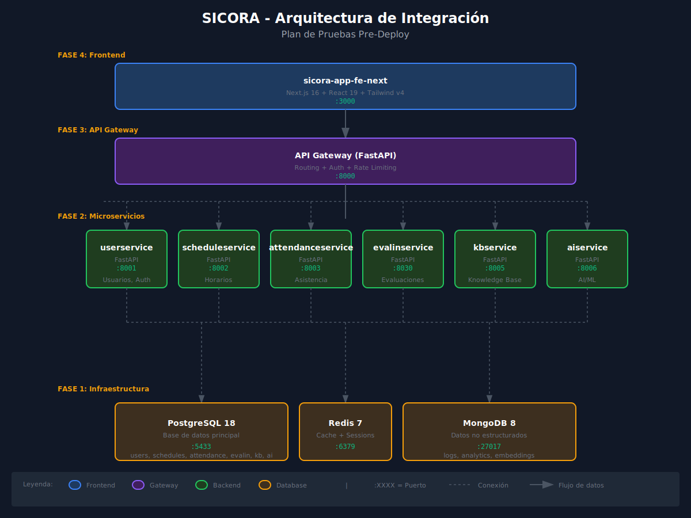

# Plan de Pruebas Pre-Deploy - SICORA

## 📋 Resumen

Este documento define el plan de pruebas de integración completo antes del deploy a producción.
Incluye verificación de infraestructura, backend, frontend y la integración entre todos los componentes.

---

## 🏗️ Arquitectura de Servicios



```
┌─────────────────────────────────────────────────────────────────────────────┐
│                              FRONTEND                                        │
│                     sicora-app-fe-next (Next.js)                            │
│                          Puerto: 3000                                        │
└─────────────────────────────────┬───────────────────────────────────────────┘
                                  │
                                  ▼
┌─────────────────────────────────────────────────────────────────────────────┐
│                            API GATEWAY                                       │
│                    sicora_apigateway (FastAPI)                              │
│                          Puerto: 8000                                        │
└─────────────────────────────────┬───────────────────────────────────────────┘
                                  │
        ┌─────────────┬───────────┼───────────┬─────────────┬─────────────┐
        ▼             ▼           ▼           ▼             ▼             ▼
┌───────────┐ ┌───────────┐ ┌───────────┐ ┌───────────┐ ┌───────────┐ ┌───────────┐
│userservice│ │schedule   │ │attendance │ │evalin     │ │kbservice  │ │aiservice  │
│  :8001    │ │service    │ │service    │ │service    │ │  :8005    │ │  :8007    │
│   (Go)    │ │  :8002    │ │  :8003    │ │  :8004    │ │   (Go)    │ │ (Python)  │
│           │ │   (Go)    │ │   (Go)    │ │   (Go)    │ │           │ │           │
└─────┬─────┘ └─────┬─────┘ └─────┬─────┘ └─────┬─────┘ └─────┬─────┘ └─────┬─────┘
      │             │             │             │             │             │
      └─────────────┴─────────────┴──────┬──────┴─────────────┴─────────────┘
                                         │
                    ┌────────────────────┼────────────────────┐
                    ▼                    ▼                    ▼
             ┌───────────┐        ┌───────────┐        ┌───────────┐
             │ PostgreSQL│        │   Redis   │        │  MongoDB  │
             │   :5433   │        │   :6379   │        │  :27017   │
             │ +pgvector │        └───────────┘        └───────────┘
             └───────────┘
```

---

## 📦 FASE 1: Verificación de Infraestructura

### 1.1 Levantar Bases de Datos

```bash
# Navegar a infraestructura
cd sicora-infra/docker

# Levantar solo bases de datos primero
docker compose up -d postgres redis mongodb

# Esperar 10 segundos para inicialización
sleep 10
```:

### 1.2 Verificar PostgreSQL

```bash
# Estado del contenedor
docker compose ps postgres

# Test de conexión
docker exec -it sicora_postgres psql -U postgres -d sicora_db -c "SELECT version();"

# Verificar schemas creados
docker exec -it sicora_postgres psql -U postgres -d sicora_db -c "\dn"

# Verificar tablas en cada schema
docker exec -it sicora_postgres psql -U postgres -d sicora_db -c "
SELECT schemaname, tablename 
FROM pg_tables 
WHERE schemaname NOT IN ('pg_catalog', 'information_schema')
ORDER BY schemaname, tablename;"
```

**✅ Criterio de éxito:**
- [ ] Contenedor `sicora_postgres` en estado `running`
- [ ] Conexión exitosa a la base de datos
- [ ] Schemas `users`, `schedules`, `attendance`, `evalin`, `kb`, `ai` existen
- [ ] Tablas principales creadas en cada schema

### 1.3 Verificar Redis

```bash
# Estado del contenedor
docker compose ps redis

# Test de conexión
docker exec -it sicora_redis redis-cli ping

# Verificar info
docker exec -it sicora_redis redis-cli info server | head -10
```

**✅ Criterio de éxito:**
- [ ] Contenedor `sicora_redis` en estado `running`
- [ ] Respuesta `PONG` al ping

### 1.4 Verificar MongoDB

```bash
# Estado del contenedor
docker compose ps mongodb

# Test de conexión
docker exec -it sicora_mongodb mongosh --eval "db.adminCommand('ping')"

# Verificar bases de datos
docker exec -it sicora_mongodb mongosh --eval "show dbs"
```

**✅ Criterio de éxito:**
- [ ] Contenedor `sicora_mongodb` en estado `running`
- [ ] Conexión exitosa
- [ ] Base de datos `sicora_nosql` existe

---

## 🔧 FASE 2: Verificación de Backend Services

### 2.1 Levantar Todos los Servicios

```bash
cd sicora-infra/docker

# Levantar todos los servicios backend
docker compose up -d

# Ver estado de todos los contenedores
docker compose ps
```

### 2.2 Health Check - User Service (Puerto 8001)

```bash
# Health check
curl -s http://localhost:8001/health | jq .

# Documentación OpenAPI
curl -s http://localhost:8001/docs -o /dev/null -w "%{http_code}"

# Test endpoint básico
curl -s http://localhost:8001/api/v1/users/me -H "Authorization: Bearer test" | jq .
```

**✅ Criterio de éxito:**
- [ ] Health check retorna `{"status": "healthy"}`
- [ ] Swagger docs accesible (HTTP 200)
- [ ] Endpoint responde (aunque sea error de autenticación)

### 2.3 Health Check - Schedule Service (Puerto 8002)

```bash
# Health check
curl -s http://localhost:8002/health | jq .

# Documentación OpenAPI
curl -s http://localhost:8002/docs -o /dev/null -w "%{http_code}"
```

**✅ Criterio de éxito:**
- [ ] Health check retorna `{"status": "healthy"}`
- [ ] Swagger docs accesible (HTTP 200)

### 2.4 Health Check - Attendance Service (Puerto 8003)

```bash
# Health check
curl -s http://localhost:8003/health | jq .

# Documentación OpenAPI
curl -s http://localhost:8003/docs -o /dev/null -w "%{http_code}"
```

**✅ Criterio de éxito:**
- [ ] Health check retorna `{"status": "healthy"}`
- [ ] Swagger docs accesible (HTTP 200)

### 2.5 Health Check - Evalin Service (Puerto 8004)

```bash
# Health check
curl -s http://localhost:8004/health | jq .

# Documentación OpenAPI
curl -s http://localhost:8004/docs -o /dev/null -w "%{http_code}"
```

**✅ Criterio de éxito:**
- [ ] Health check retorna `{"status": "healthy"}`
- [ ] Swagger docs accesible (HTTP 200)

### 2.6 Health Check - KB Service (Puerto 8005)

```bash
# Health check
curl -s http://localhost:8005/health | jq .

# Documentación OpenAPI
curl -s http://localhost:8005/docs -o /dev/null -w "%{http_code}"
```

**✅ Criterio de éxito:**
- [ ] Health check retorna `{"status": "healthy"}`
- [ ] Swagger docs accesible (HTTP 200)

### 2.7 Health Check - AI Service (Puerto 8007)

```bash
# Health check
curl -s http://localhost:8007/health | jq .

# Documentación OpenAPI
curl -s http://localhost:8007/docs -o /dev/null -w "%{http_code}"
```

**✅ Criterio de éxito:**
- [ ] Health check retorna `{"status": "healthy"}`
- [ ] Swagger docs accesible (HTTP 200)

### 2.8 Health Check - API Gateway (Puerto 8000)

```bash
# Health check general
curl -s http://localhost:8000/health | jq .

# Health check de todos los servicios
curl -s http://localhost:8000/api/v1/health/all | jq .

# Documentación OpenAPI
curl -s http://localhost:8000/docs -o /dev/null -w "%{http_code}"
```

**✅ Criterio de éxito:**
- [ ] Health check retorna `{"status": "healthy"}`
- [ ] Todos los servicios downstream reportan healthy
- [ ] Swagger docs accesible (HTTP 200)

---

## 🖥️ FASE 3: Verificación de Frontend

### 3.1 Levantar Frontend en Desarrollo

```bash
cd sicora-app-fe-next

# Instalar dependencias si es necesario
pnpm install

# Levantar en modo desarrollo
pnpm dev
```

### 3.2 Verificar Frontend

```bash
# Health check
curl -s http://localhost:3000 -o /dev/null -w "%{http_code}"

# Verificar que carga la página
curl -s http://localhost:3000 | grep -o "<title>.*</title>"
```

**✅ Criterio de éxito:**
- [ ] Frontend responde en puerto 3000 (HTTP 200)
- [ ] Página carga correctamente

---

## 🔗 FASE 4: Pruebas de Integración BE + FE

### 4.1 Flujo de Autenticación

#### 4.1.1 Login desde Frontend

```bash
# Probar endpoint de login a través del API Gateway
curl -X POST http://localhost:8000/api/v1/auth/login \
  -H "Content-Type: application/json" \
  -d '{
    "email": "admin@sicora.edu.co",
    "password": "Admin123!"
  }' | jq .
```

**Guardar el token para pruebas posteriores:**
```bash
export TOKEN=$(curl -s -X POST http://localhost:8000/api/v1/auth/login \
  -H "Content-Type: application/json" \
  -d '{"email": "admin@sicora.edu.co", "password": "Admin123!"}' | jq -r '.data.access_token')

echo "Token: $TOKEN"
```

**✅ Criterio de éxito:**
- [ ] Login retorna token JWT válido
- [ ] Respuesta incluye datos del usuario

#### 4.1.2 Verificar Sesión

```bash
curl -s http://localhost:8000/api/v1/auth/me \
  -H "Authorization: Bearer $TOKEN" | jq .
```

**✅ Criterio de éxito:**
- [ ] Endpoint retorna datos del usuario autenticado
- [ ] Token es válido y no ha expirado

### 4.2 Flujo de Usuarios

#### 4.2.1 Listar Usuarios

```bash
curl -s "http://localhost:8000/api/v1/users?page=1&limit=10" \
  -H "Authorization: Bearer $TOKEN" | jq .
```

**✅ Criterio de éxito:**
- [ ] Retorna lista de usuarios paginada
- [ ] Estructura de respuesta correcta

#### 4.2.2 Obtener Usuario por ID

```bash
# Obtener ID del primer usuario de la lista
USER_ID=$(curl -s "http://localhost:8000/api/v1/users?page=1&limit=1" \
  -H "Authorization: Bearer $TOKEN" | jq -r '.data.items[0].id')

curl -s "http://localhost:8000/api/v1/users/$USER_ID" \
  -H "Authorization: Bearer $TOKEN" | jq .
```

**✅ Criterio de éxito:**
- [ ] Retorna datos completos del usuario

### 4.3 Flujo de Horarios (Schedules)

#### 4.3.1 Listar Horarios

```bash
curl -s "http://localhost:8000/api/v1/schedules?page=1&limit=10" \
  -H "Authorization: Bearer $TOKEN" | jq .
```

**✅ Criterio de éxito:**
- [ ] Retorna lista de horarios paginada

#### 4.3.2 Obtener Horario por Fecha

```bash
curl -s "http://localhost:8000/api/v1/schedules/date/$(date +%Y-%m-%d)" \
  -H "Authorization: Bearer $TOKEN" | jq .
```

**✅ Criterio de éxito:**
- [ ] Retorna horarios del día actual

### 4.4 Flujo de Asistencia (Attendance)

#### 4.4.1 Listar Registros de Asistencia

```bash
curl -s "http://localhost:8000/api/v1/attendance?page=1&limit=10" \
  -H "Authorization: Bearer $TOKEN" | jq .
```

**✅ Criterio de éxito:**
- [ ] Retorna lista de asistencia paginada

#### 4.4.2 Registrar Asistencia (POST)

```bash
curl -X POST "http://localhost:8000/api/v1/attendance" \
  -H "Authorization: Bearer $TOKEN" \
  -H "Content-Type: application/json" \
  -d '{
    "schedule_id": "UUID_DEL_HORARIO",
    "student_id": "UUID_DEL_ESTUDIANTE",
    "status": "present",
    "notes": "Prueba de integración"
  }' | jq .
```

**✅ Criterio de éxito:**
- [ ] Registro creado exitosamente
- [ ] Retorna ID del nuevo registro

### 4.5 Flujo de Evaluaciones (Evalin)

#### 4.5.1 Listar Evaluaciones

```bash
curl -s "http://localhost:8000/api/v1/evaluations?page=1&limit=10" \
  -H "Authorization: Bearer $TOKEN" | jq .
```

**✅ Criterio de éxito:**
- [ ] Retorna lista de evaluaciones

---

## 🧪 FASE 5: Pruebas de Integración Automatizadas

### 5.1 Ejecutar Tests de Frontend

```bash
cd sicora-app-fe-next

# Tests unitarios
pnpm test

# Tests con coverage
pnpm test:coverage
```

**✅ Criterio de éxito:**
- [ ] Todos los tests pasan (562 tests)
- [ ] Coverage > 19% (actual)

### 5.2 Ejecutar Tests de Backend (si existen)

```bash
cd sicora-be-python

# Tests con pytest
pytest -v

# O con docker
docker compose exec userservice pytest -v
```

### 5.3 Tests E2E con Playwright (Frontend)

```bash
cd sicora-app-fe-next

# Ejecutar tests E2E
pnpm test:e2e
```

---

## 📊 FASE 6: Verificación de Logs y Métricas

### 6.1 Revisar Logs de Servicios

```bash
cd sicora-infra/docker

# Logs del API Gateway
docker compose logs -f apigateway --tail=50

# Logs de todos los servicios
docker compose logs -f --tail=20

# Logs de errores específicos
docker compose logs | grep -i "error\|exception\|failed"
```

### 6.2 Verificar Métricas de Contenedores

```bash
# Uso de recursos
docker stats --no-stream

# Estado de salud de contenedores
docker compose ps --format "table {{.Name}}\t{{.Status}}\t{{.Ports}}"
```

---

## 🚀 FASE 7: Checklist Final Pre-Deploy

### Infraestructura
- [x] PostgreSQL 18 + pgvector 0.8.1 funcionando
- [x] Redis funcionando (puerto 6379)
- [x] MongoDB funcionando (puerto 27017)
- [ ] Todos los contenedores en estado `healthy`

### Backend Services (Go)
- [x] User Service (8001) - Health OK ✅ `{"status":"up"}`
- [x] Schedule Service (8002) - Health OK ✅ `{"status":"up"}`
- [x] Attendance Service (8003) - Health OK ✅ `{"status":"OK"}`
- [x] Evalin Service (8004) - Health OK ✅ `{"success":true}`
- [x] KB Service (8005) - Health OK ✅ `{"status":"up"}` (pgvector enabled)
- [x] Meval Service (8006) - Health OK ✅ `{"status":"up"}`
- [x] ProjectEval Service (8008) - Health OK ✅ `{"status":"up"}`

### Backend Services (Python)
- [x] AI Service (8007) - Health OK ✅ `{"status":"healthy"}`

### Frontend
- [x] Tests unitarios pasan (562 tests)
- [ ] Aplicación carga correctamente
- [ ] Build de producción exitoso: `pnpm build`

### Integración
- [ ] Login funciona correctamente
- [ ] CRUD de usuarios funciona
- [ ] CRUD de horarios funciona
- [ ] CRUD de asistencia funciona
- [ ] Frontend se comunica con API Gateway
- [ ] Tokens JWT funcionan correctamente

### Seguridad
- [ ] Variables de entorno configuradas
- [ ] Secretos no expuestos en logs
- [ ] CORS configurado correctamente
- [ ] HTTPS configurado (para producción)

---

## 📝 Script de Verificación Automática

Crear archivo `scripts/pre-deploy-check.sh`:

```bash
#!/bin/bash

set -e

GREEN='\033[0;32m'
RED='\033[0;31m'
YELLOW='\033[1;33m'
NC='\033[0m' # No Color

echo -e "${YELLOW}========================================${NC}"
echo -e "${YELLOW}  SICORA - Pre-Deploy Check${NC}"
echo -e "${YELLOW}========================================${NC}"

# Función para verificar servicio
check_service() {
    local name=$1
    local url=$2
    local expected_code=${3:-200}
    
    response=$(curl -s -o /dev/null -w "%{http_code}" "$url" 2>/dev/null || echo "000")
    
    if [ "$response" = "$expected_code" ]; then
        echo -e "${GREEN}✓${NC} $name - OK (HTTP $response)"
        return 0
    else
        echo -e "${RED}✗${NC} $name - FAILED (HTTP $response, expected $expected_code)"
        return 1
    fi
}

echo ""
echo -e "${YELLOW}[1/4] Verificando Bases de Datos...${NC}"

# PostgreSQL
if docker exec sicora_postgres pg_isready -U postgres > /dev/null 2>&1; then
    echo -e "${GREEN}✓${NC} PostgreSQL - OK"
else
    echo -e "${RED}✗${NC} PostgreSQL - FAILED"
fi

# Redis
if docker exec sicora_redis redis-cli ping > /dev/null 2>&1; then
    echo -e "${GREEN}✓${NC} Redis - OK"
else
    echo -e "${RED}✗${NC} Redis - FAILED"
fi

# MongoDB
if docker exec sicora_mongodb mongosh --eval "db.adminCommand('ping')" > /dev/null 2>&1; then
    echo -e "${GREEN}✓${NC} MongoDB - OK"
else
    echo -e "${RED}✗${NC} MongoDB - FAILED"
fi

echo ""
echo -e "${YELLOW}[2/4] Verificando Backend Services...${NC}"

check_service "User Service" "http://localhost:8001/health"
check_service "Schedule Service" "http://localhost:8002/health"
check_service "Attendance Service" "http://localhost:8003/health"
check_service "Evalin Service" "http://localhost:8004/health"
check_service "KB Service" "http://localhost:8005/health"
check_service "Meval Service" "http://localhost:8006/health"
check_service "AI Service" "http://localhost:8007/health"
check_service "ProjectEval Service" "http://localhost:8008/health"
check_service "API Gateway" "http://localhost:8000/health"

echo ""
echo -e "${YELLOW}[3/4] Verificando Frontend...${NC}"

check_service "Frontend (Next.js)" "http://localhost:3000"

echo ""
echo -e "${YELLOW}[4/4] Verificando Integración...${NC}"

# Test de login
LOGIN_RESPONSE=$(curl -s -X POST http://localhost:8000/api/v1/auth/login \
    -H "Content-Type: application/json" \
    -d '{"email": "admin@sicora.edu.co", "password": "Admin123!"}' 2>/dev/null)

if echo "$LOGIN_RESPONSE" | grep -q "access_token"; then
    echo -e "${GREEN}✓${NC} Login Integration - OK"
else
    echo -e "${RED}✗${NC} Login Integration - FAILED"
fi

echo ""
echo -e "${YELLOW}========================================${NC}"
echo -e "${YELLOW}  Verificación Completada${NC}"
echo -e "${YELLOW}========================================${NC}"
```

---

## 🔄 Comandos Rápidos

### Levantar Todo
```bash
# Infraestructura
cd sicora-infra/docker && docker compose up -d

# Frontend (en otra terminal)
cd sicora-app-fe-next && pnpm dev
```

### Detener Todo
```bash
cd sicora-infra/docker && docker compose down
```

### Ver Logs en Tiempo Real
```bash
cd sicora-infra/docker && docker compose logs -f
```

### Reiniciar un Servicio
```bash
cd sicora-infra/docker && docker compose restart userservice
```

### Limpiar y Reiniciar
```bash
cd sicora-infra/docker
docker compose down -v  # Elimina volúmenes
docker compose up -d --build  # Reconstruye imágenes
```

---

## 📚 Referencias

- [Arquitectura de Microservicios](./../desarrollo/ARQUITECTURA.md)
- [Configuración de Docker](../../sicora-infra/README.md)
- [API Gateway](../../sicora-infra/docker/01-fastapi/apigateway/README.md)
- [Frontend Next.js](../../sicora-app-fe-next/README.md)

---

**Última actualización:** 2026-01-09
**Autor:** GitHub Copilot
**Versión:** 1.2.0

### Historial de Cambios
| Versión | Fecha | Descripción |
|---------|-------|-------------|
| 1.2.0 | 2026-01-09 | ✅ Todos los servicios Go UP: MevalService (8006), ProjectEvalService (8008) completados |
| 1.1.0 | 2026-01-09 | Actualizado con estado real de servicios Go, corregido puerto KBService (8005), agregado pgvector |
| 1.0.0 | 2026-01-09 | Versión inicial del plan de pruebas |
